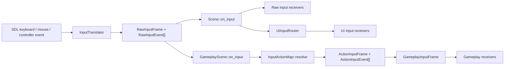
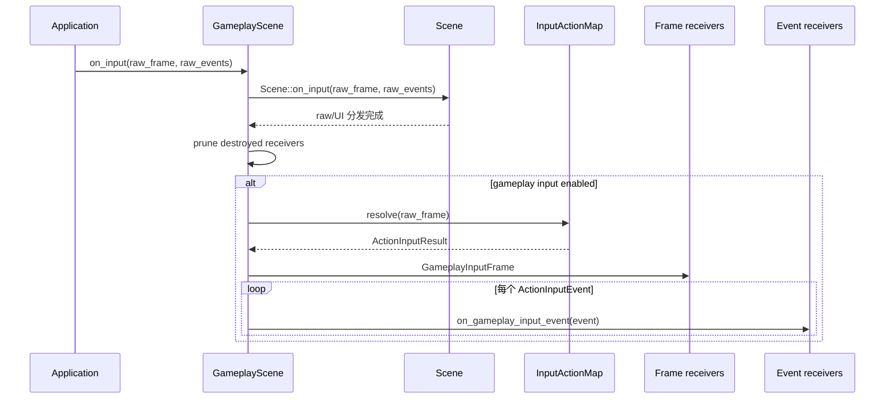

# Input 架构与一帧输入流

## 分层职责

| 层 | 主要类型 | 职责 | 不负责 |
| --- | --- | --- | --- |
| 平台翻译 | `InputSystem`、各类 `InputTranslator` | 将 SDL 事件归一化为键盘、鼠标、手柄 Control/Axis | Jump、Attack 等游戏语义 |
| Raw Input | `RawInputState`、`RawInputFrame`、`RawInputEvent` | 保存物理输入当前状态、设备和离散事件 | 可改键的逻辑 Action |
| Action Input | `InputActionMap`、`ActionInputFrame`、`ActionInputEvent` | 将物理 Control/Axis 映射为稳定 Action ID 和统一值 | MoonLine 特有玩法规则 |
| Gameplay Support | 标准 `actions`、`GameplayInputFrame` | 提供 Move、Jump、Primary 等可复用语义 | 角色具体如何响应动作 |
| 场景分发 | `GameplayScene`、两个 receiver contract | 选择何时翻译，并按 SceneObject 顺序分发 | 输入配置持久化 |



`GameplayScene::on_input` 内部首先调用 `Scene::on_input`，因此图中的基础 Scene 分支也会发生在 GameplayScene 中。普通 `Scene` 不持有 `InputActionMap`，不会发现或调用 gameplay receiver。

## Frame 与 Event 是两种读取方式

`RawInputFrame` 和 `ActionInputFrame` 都描述“一整帧的状态”，适合移动、蓄力、持续防御等每帧查询。`RawInputEvent` 描述 SDL 翻译后的离散输入；`ActionInputEvent` 则由 `InputActionMap` 比较本次与上次 `resolve()` 的解析值后合成。

这意味着 Action event 不是逐条转发 `RawInputEvent`：

- 多个物理键映射到同一 Action 时，只按最终 Action 值生成一次状态变化。
- 调用方即使传给 `GameplayScene` 一个空的 Raw event 数组，只要 `RawInputFrame` 发生变化，仍能生成 Action event。
- `InputActionMap` 必须按帧连续调用，才能保留正确的前后值和边沿。



## 输入设备与坐标约定

- 摇杆轴归一化到 `[-1, 1]`，扳机归一化到 `[0, 1]`。
- 二维移动中 X 向右为正，Y 向下为正，因此 Up/W 贡献 `-1`。
- Raw 层提供左/右摇杆 X/Y 与左右扳机；标准 gameplay map 只将左摇杆映射到 `gameplay.move`。
- DPad 是四个按钮 Control，在 gameplay map 中通过 `Button2DInputBinding` 合成为二维移动。
- 左右扳机还会以 `0.5` 按下、`0.4` 释放的迟滞阈值产生虚拟按钮，但标准 gameplay map 当前未绑定它们。

## 与 UI 输入的边界

基础 `Scene` 始终先分发 Raw Input，再通过 `UiInputRouter` 分发 UI Input。GameplayScene 随后才分发 gameplay 输入，因此 UI event 的“已消费”状态不会自动阻止 gameplay Action。

打开暂停菜单或 modal overlay 时，如果 gameplay 对象不应继续响应，应由 GameplayScene 调用 `set_gameplay_input_enabled(false)`，或暂停场景并只让明确选择 `receive_input_when_paused()` 的对象接收输入。

鼠标位置、鼠标移动、滚轮、文本输入和 IME 编辑不进入 Action Mapping；这些信息继续使用 Raw/UI 输入 API。

## 依赖方向

```text
gameplay scene
  -> engine/gameplay_support
       -> engine/input/action
            -> engine/input/raw
```

`application` 只负责主循环与 Scene 注册。标准 gameplay input 不依赖项目的 `gameplay/` 目录，也不依赖 UserConfig。

