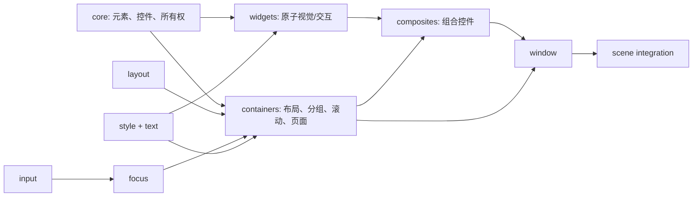
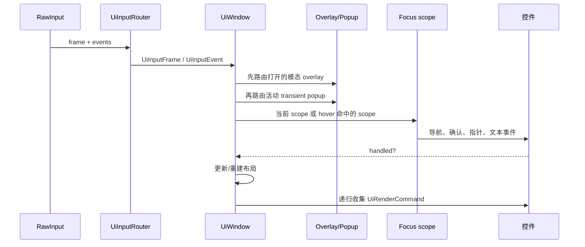
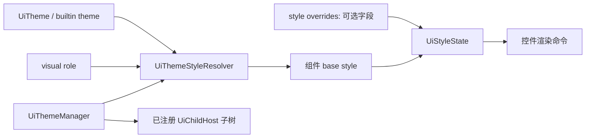

# 当前 UI 架构与实现思路

> 本文说明协作关系。逐类公开接口、调用顺序和所有权规则请从 [UI API 参考入口](README.md) 进入对应组件页或专题页。

本文描述仓库当前实现，不是未来重构提案。

## 分层与依赖

`UiElement` 提供矩形、绘制顺序、透明度和 render-command 提交；`UiControl` 再添加启用
和焦点状态。`UiChildHost` 以 `unique_ptr` 拥有子树，并向子项传播 update、每帧输入、离散
事件、渲染以及布局失效。容器不嵌入屏幕语义；复合组件通过拥有子控件和焦点委托组合功能，
避免继承具体 widget。

## 一帧的数据流

子节点按 UI order 提交命令。`UiChildHost` 在需要时对一段子命令统一施加父级透明度与裁剪，
所以内容矩形、clip 与 opacity 可以组合而不要求每个子控件自行实现。布局以 `screen_rect`
为输入/输出；子元素尺寸或内在尺寸变化会向父 host 标脏，之后重建。

## 焦点与窗口层级

窗口保存注册的 `UiFocusScope` 及其四向邻居；scope 保存其控件与方向邻居。设备无关的
`UiAction` 先在 scope 内尝试导航，到边界后由窗口切换 scope。窗口还跟踪最近驱动焦点的
设备，以区分指针与键盘/手柄策略。滚动容器作为嵌套 scope 时会优先处理最深层可滚动内容，
并在手柄滚动时暂时协调焦点显示。

Overlay 是窗口登记的 child 表面：模态层遮挡背景输入，关闭时可恢复原 scope；位置由
`UiOverlayPlacement` 和窗口内容边界决定。Transient popup 不是 child 的所有权转移，
而是控件向窗口提供一个渲染/输入协议；tooltip 最后绘制且保持被动。

## 样式与主题

主题由 `UiThemeManager` 应用于注册根及其后续子树。Resolver 使用元素类型与 visual role
选择主题样式；`UiStyleState` 将局部覆盖叠加到基础样式。复合组件内部 child 可标记为
实现细节，以便继承复合组件的语义样式而不被当成独立主题根。该设计允许切换主题时保留
调用方明确覆盖的字段。

## 关键约束

- `screen_rect` 是几何真相；布局负责计算，输入和渲染消费结果。
- 公开返回的子元素指针不拥有对象；所有权始终在 host 或复合组件。
- 注册关系是借用关系，必须随窗口/对象销毁解除；测试覆盖 overlay、popup、tooltip 生命周期。
- UI 只生成 `UiRenderCommand`；实际 SDL 绘制位于 UI 模块之外的渲染基础设施。
