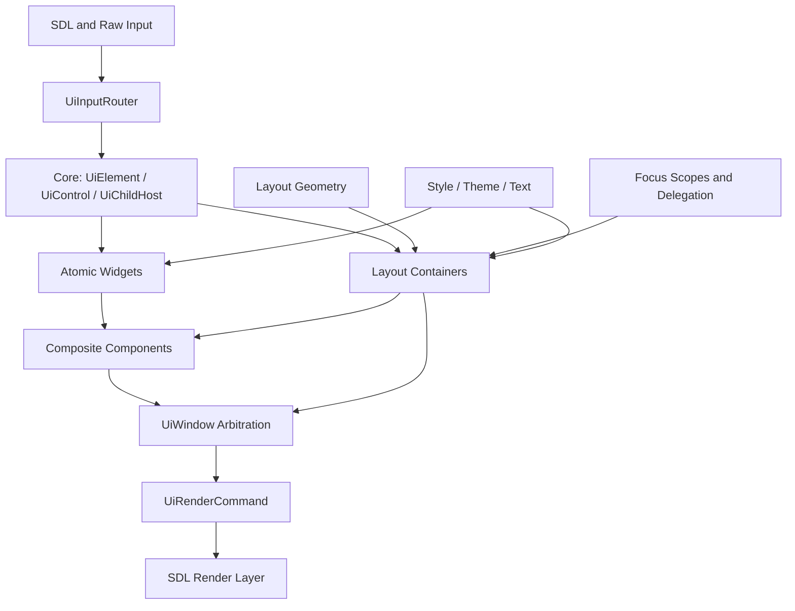
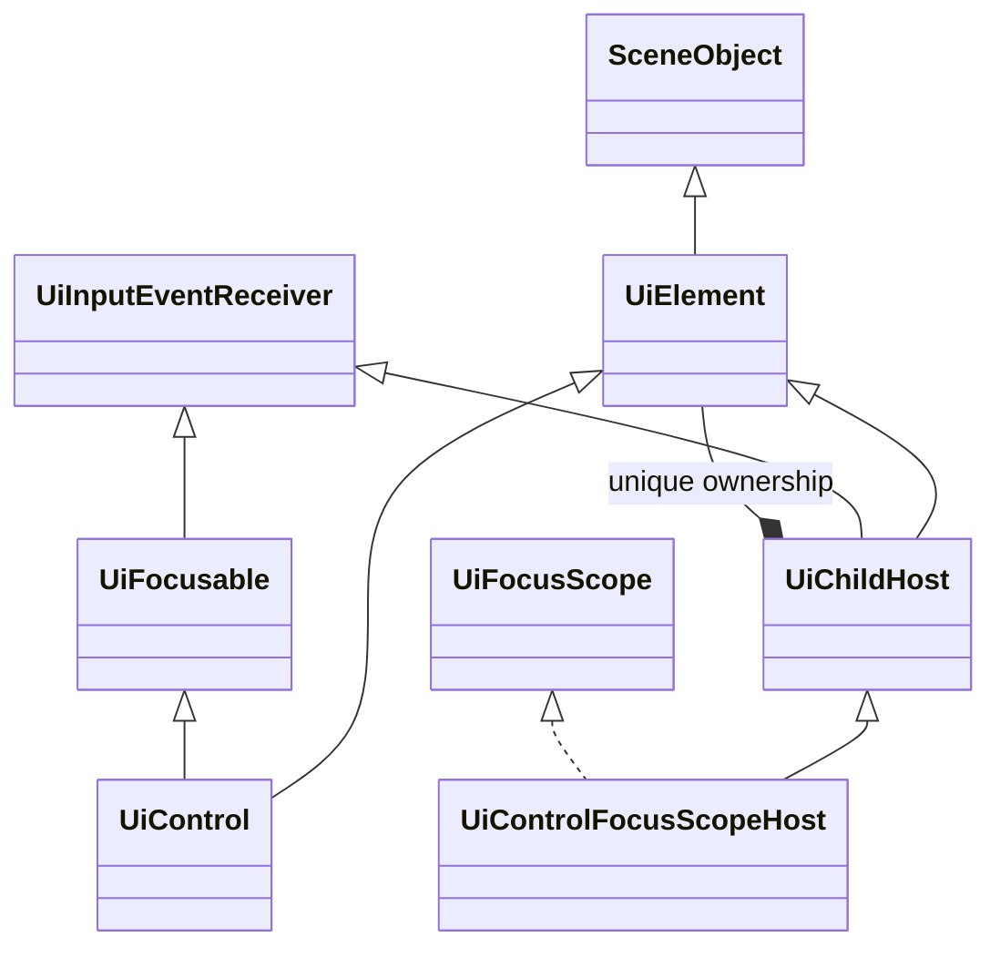
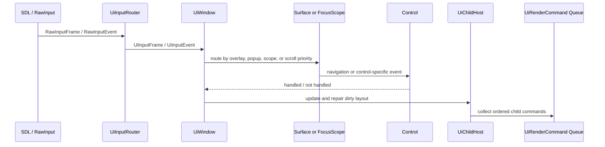
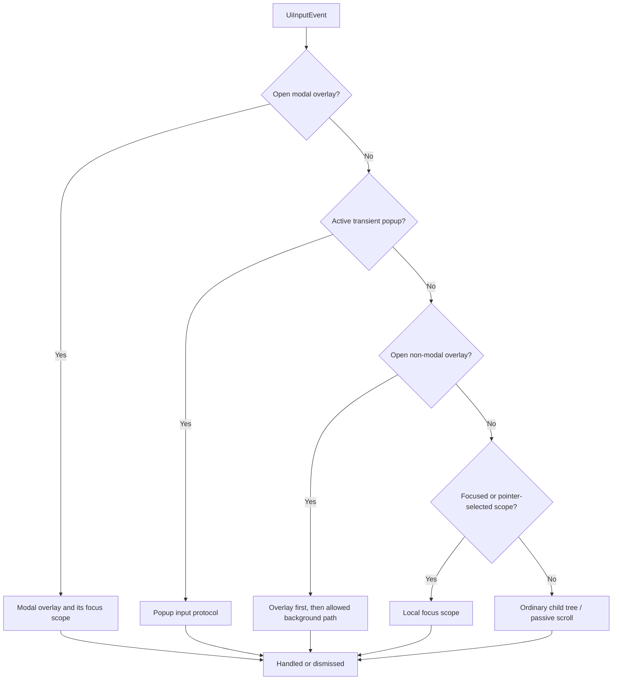
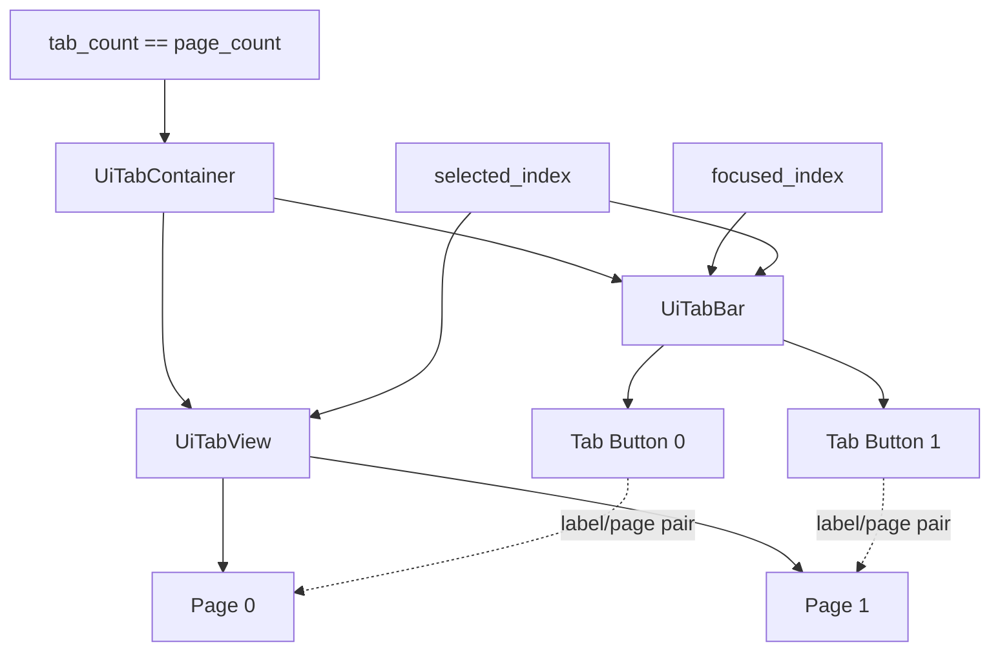
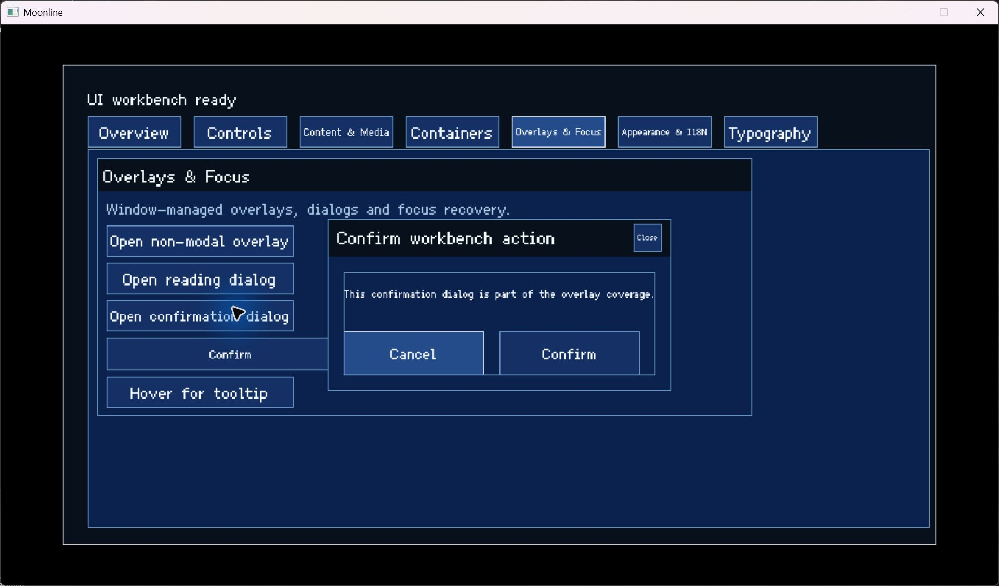

# Design and Implementation of a Composable Multi-Input UI Framework for 2D Games: A Case Study of Elysia Engine

> **Document type:** Undergraduate course paper  
> **Verified revision:** `dfac1cee3d90e2476140701cd9c432a8e4e0ca36`  
> **Verification date:** July 20, 2026 (Pacific Daylight Time)  
> **Implementation context:** Elysia Engine `engine/ui`, hosted in the Moonline game repository

## Abstract

Game user interfaces must work with several input devices, support nested menus, and keep focus correct while controls appear and disappear. These needs are difficult to handle if each widget implements its own routing rules. This paper presents the retained UI framework used by Elysia Engine, a C++23 2D game engine subsystem developed inside the Moonline project. The framework separates persistent UI elements, interactive controls, child-owning containers, local focus scopes, and window-level policies. `UiWindow` gives one place for focus-scope navigation, modal overlays, transient popups, passive tooltips, and scroll-target selection. Containers use `std::unique_ptr` for child ownership, while public raw pointers are normally borrowed views. A detailed `UiTabContainer` case study shows how composition, focus delegation, and the invariant `tab_count == page_count` work together. The paper also examines layout, styling, text, presentation effects, and render-command generation. At the verified revision, the UI module contained 133 C++ source and header files with 23,532 physical lines. Its test group contained 13 CTest suites, 56 named test functions, and 419 source-level calls to the local `require(...)` helper. All 13 suites passed in each of ten consecutive runs on a Windows MSVC Debug build. These results support the tested behavior of the current implementation, but they do not prove cross-platform completeness, accessibility, or performance at large scale.

**Keywords:** game user interface, retained-mode UI, focus navigation, multi-input, composition, C++ ownership, Elysia Engine

## 1. Introduction

### 1.1 Problem background

A game UI is more than a set of buttons drawn on top of a scene. A main menu may be simple, but a settings screen can contain tab pages, scrollable sections, text fields, popups, tooltips, and a confirmation dialog at the same time. The same screen may be controlled by a mouse, keyboard, or gamepad. Each device has different expectations. A mouse points directly at a position. A keyboard or gamepad usually moves a logical focus. Text input needs character and composition events. An analog stick may also act as a repeated navigation or scrolling source.

SDL places keyboard, mouse, wheel, text, window, and controller data in the common `SDL_Event` union [1]. Its controller mapping support also helps normalize physical gamepads into stable logical gamepad controls [2]. Those services are a useful platform base, but they do not decide what a game UI action means. The engine still needs rules for actions such as Navigate Left, Confirm, Cancel, Home, or Page Down. It also needs to decide which control receives an action when a modal dialog, dropdown popup, or nested focus region is active.

Focus adds another source of complexity. The W3C keyboard-interface guidance separates movement between components from directional movement inside composite components [3]. Its Tabs Pattern also allows focus movement and tab activation to be separate operations [4]. These ideas come from web accessibility work, but the interaction distinction is also useful in a game menu. A player may move across tab labels without changing the page until Confirm is pressed. A focus target can also become invalid when a page is hidden or a child is removed. The framework must repair that state without leaving two controls focused or sending input to a destroyed object.

The UI programming model also affects the design. Dear ImGui describes a simple contrast between immediate-mode APIs and traditional toolkits that retain a widget tree [5]. Elysia Engine uses persistent C++ objects. This approach makes hierarchical layout, cached state, clipping, focus scopes, and long-lived composite controls natural. It also creates responsibilities: the tree needs explicit ownership, invalidation, cleanup, and state synchronization. This paper studies how the current framework handles those responsibilities. It does not argue that retained mode is always better than immediate mode.

### 1.2 Research question and scope

The main question is:

> How can a small 2D game engine organize a persistent UI framework so that layout, ownership, multi-device input, nested focus, and layered surfaces remain composable and testable?

The paper answers this question through the current `elysia::ui` implementation. The scope includes the following areas:

- the persistent UI object model;
- child ownership and dynamic tree mutation;
- anchor, list, grid, and scroll layout;
- styles, themes, text, and presentation effects;
- normalization of keyboard, mouse, and gamepad input;
- local focus graphs and delegated nested focus;
- overlay, popup, tooltip, and scroll arbitration at the window level;
- composite components, with `UiTabContainer` as the main case study;
- automated and interactive verification available in the repository.

The paper does not cover gameplay HUD data binding, editor tooling, save data, networking, or the complete rendering back end. Elysia UI emits `UiRenderCommand` values; SDL execution of those commands belongs to the engine rendering layer. Moonline is the game project that hosts and uses the engine code. Throughout this paper, the engine is called **Elysia Engine**.

### 1.3 Main engineering contributions

The framework makes four main engineering choices.

First, it separates basic element state from interactive and child-owning capabilities. `UiControl` and `UiChildHost` form separate branches derived from `UiElement`; a container is not forced to pretend that it is one atomic button-like control.

Second, it makes child ownership explicit. Containers receive `std::unique_ptr<UiElement>` and return raw pointers only for non-owning access. This follows the general C++ guidance that smart pointers should express ownership transfer, while raw pointers normally represent non-owning access [6]. Stable child-lifetime records protect cached traversal handles when callbacks change the UI tree.

Third, it splits local mechanism from global policy. Focus scopes manage control-to-control navigation inside one region. `UiWindow` manages movement between scopes and decides whether a modal overlay, transient popup, tooltip, focused scroll area, or ordinary child tree has priority.

Fourth, it builds larger controls through composition. `UiTabContainer` owns a tab bar and a tab view, and `UiConfirmationDialog` owns a chrome container and action controls. The outer composite coordinates invariants, callbacks, delegated focus, and theme behavior instead of inheriting from a visually similar concrete widget.

These are not new algorithms. Their value is that they form one consistent implementation with documented boundaries and automated tests.

## 2. Requirements and Design Goals

### 2.1 Functional requirements

The framework was developed for menus and game-facing screens in a 2D engine. Its main functional requirements are listed in Table 1.

| Requirement | Framework response | Main owner |
| --- | --- | --- |
| Persistent visual elements | Rectangle, order, opacity, visibility, presentation translation, and render-command submission | `UiElement` |
| Interactive controls | Enabled and focused state plus discrete input reception | `UiControl` and `UiFocusable` |
| Nested ownership | Exclusive child ownership, extraction, cleanup, update, input, and render traversal | `UiChildHost` |
| Reusable layout | Anchor, one-dimensional list, two-dimensional grid, padding, alignment, and scroll viewport | Layout helpers and containers |
| Multiple input devices | Device-independent UI actions plus pointer, text, wheel, and axis payloads | `UiInputRouter` |
| Directional navigation | Local control graph, neighboring scopes, nested focus delegation, and repair | Focus subsystem and `UiWindow` |
| Layered surfaces | Modal overlays, transient popups, passive tooltips, placement, dismissal, and focus restoration | `UiWindow` |
| Consistent presentation | Theme colors, field-level style overrides, typography roles, clipping, opacity, and translation effects | Style, text, effects, and render commands |
| Reusable complex controls | Tabs, dropdowns, dialogs, labeled controls, and settings preset | Composite layer |

*Table 1. Design requirements and their main owners.*

### 2.2 Design goals

The first goal is **clear responsibility**. Input translation should not know how a tab page is built. A tooltip should not decide global z-order. A layout helper should not own scene objects. The code therefore keeps platform input, UI actions, local focus, window routing, and rendering as separate stages.

The second goal is **composition**. The system should be able to put a list inside a scroll container, place that scroll container inside a tab page, and place the tabs inside a window. The same leaf controls should work without learning every possible parent type.

The third goal is **predictable lifetime**. The owner of a child should be visible in the type system. Tree traversal should remain safe when callbacks remove or reorder children. Borrowed registrations should be pruned or explicitly unregistered when possible.

The fourth goal is **device-independent intent with device-aware policy**. A keyboard arrow and a gamepad direction can both become `UiAction::NavigateDown`. The event still keeps its `InputDevice`, because pointer focus and gamepad focus need different behavior. Abstracting actions does not mean erasing all device information.

The fifth goal is **testable state transitions**. Focus repair, popup cleanup, selection synchronization, style cascading, clipping, and callbacks should be observable without requiring a full gameplay scene. The repository therefore builds UI behavior as separate CTest targets and also includes an interactive UI test scene.

### 2.3 Non-goals

The current system is not intended to be a general desktop GUI toolkit. It does not provide an accessibility tree, screen-reader semantics, a visual editor, declarative markup, automatic data binding, or a complete input-method abstraction for every platform. Touch is not represented as a first-class `InputDevice` in the UI types. The built-in theme payload mainly controls colors; it is not a general design-token system for every metric. These limits are important because the module should be judged against its current game-engine purpose rather than a larger product category.

## 3. Overall Architecture

### 3.1 Layered structure

The implementation is divided by responsibility rather than by screen. Figure 1 gives a simplified dependency view.



*Figure 1. Main layers of the Elysia Engine UI framework.*

`core` defines the base tree roles. `layout` contains reusable geometry rules. `widgets` contains atomic visual or interactive elements such as buttons, sliders, text inputs, labels, images, and bars. `containers` owns and arranges subtrees. `focus` describes local navigation regions and delegation. `composites` coordinates multiple widgets or containers into one useful component. `window` owns global interaction policies. `style`, `text`, and `effects` provide cross-cutting presentation data.

This is a retained object model. UI elements persist across frames and are updated when state changes. The system can therefore keep a focus graph, selected indices, scroll offsets, text-editing state, and presentation animations. The cost is that invalidation and cleanup must be correct when the tree changes.

### 3.2 The three core roles

`UiElement` is the common node. It derives from the engine's `SceneObject`, but it adds UI-specific screen-space geometry, visual order, opacity, presentation translation, and render-command submission. It also stores a non-owning layout-parent pointer. `screen_rect` stores the allocated layout geometry. Pointer hit testing normally uses `presentation_screen_rect()`, which adds the accumulated presentation translation. An entrance animation can therefore move the rendered and hit-tested result without rewriting the layout allocation every frame.

`UiControl` adds `UiFocusable`. `UiFocusable` is an input-receiver capability, and `UiControl` combines it with an element. This branch represents atomic interaction. A button, checkbox, slider, or text field can be enabled, focused, and asked to consume an event.

`UiChildHost` takes the other branch. It combines `UiElement` with update, frame-input, and discrete-event receivers. It owns a vector of `ChildEntry` records. Each entry contains a `std::unique_ptr<UiElement>`, layout options, style-relation metadata, and a shared lifetime record used by cached traversal handles. A host can therefore own non-interactive content, interactive controls, other hosts, or complete focus scopes.



*Figure 2. Core type roles and child ownership.*

The important point is that `UiControl` and `UiChildHost` do not form one straight inheritance chain. A child-owning panel does not automatically receive atomic-control semantics. When a container also needs to manage a local control graph, it derives from `UiControlFocusScopeHost`, which combines `UiChildHost` and `UiFocusScope`.

### 3.3 One-frame data flow

The data flow is staged. Raw input becomes a UI frame snapshot and zero or more UI events. The window applies global priority. The chosen focus scope or subtree applies local rules. Updates and layout repair happen before render-command collection.



*Figure 3. Simplified frame flow from raw input to rendering commands.*

The framework treats a frame snapshot and a discrete event as different data forms. The snapshot is useful for held states and analog values. Events are useful for transitions such as press, release, pointer movement, text input, and wheel steps. This separation reduces the need for every widget to reconstruct edges from held state.

### 3.4 Boundary with the scene and renderer

UI objects are scene objects, but the UI tree has its own ownership inside a root element such as `UiWindow`. A scene creates the root window and keeps non-owning pointers to selected controls when needed. The window or another host remains the owner.

Rendering is also separated. UI nodes append typed `UiRenderCommand` values. A parent host can apply opacity, presentation translation, and clipping to the range produced by a child. The SDL render-command executor later performs the actual drawing. This means a button does not need to save and restore SDL renderer state itself for every parent effect.

## 4. UI Tree, Layout, Styling, and Lifecycle

### 4.1 Ownership and borrowed access

`UiChildHost::add_child` accepts `std::unique_ptr<UiElement>`. Successful insertion transfers exclusive ownership into a `ChildEntry`. `create_child<T>` performs construction and transfer in one step, then returns `T*` for borrowed access. `extract_child` performs the reverse operation and returns a `unique_ptr` to the caller. This interface makes transfer visible and supports transactional composite operations.

The choice is consistent with the C++ Core Guidelines: `unique_ptr` represents single ownership and a function parameter of that type expresses transfer [6]. A raw pointer returned from `create_child` does not own the object. Code that stores it must respect the lifetime of the host and child.

The framework still uses some borrowed registration pointers. `UiWindow` stores focus scopes, overlays, transient popups, tooltips, and a passive scroll target without taking separate ownership. Most registered objects are already owned somewhere in the window tree. Pruning code checks whether they remain usable. This approach avoids shared-ownership cycles, but it is not formal lifetime safety. In particular, a `UiTooltip` owns its content but borrows its trigger. Window-managed removal can clear a trigger that leaves the same tree, yet arbitrary external trigger lifetimes still require caller discipline.

### 4.2 Safe traversal during mutation

UI callbacks can change the tree. A button callback may close a dialog, remove its parent, switch a tab, or rebuild a dropdown. Directly iterating a vector of `unique_ptr` values would be unsafe if the vector changes during a callback.

`UiChildHost` addresses this with `ChildLifetime` and `UiChildHandle`. A lifetime record stores an element pointer and generation. Cached logical and visual traversal lists keep a shared pointer to that record and the expected generation. When an entry is removed or replaced, the record is invalidated and its generation changes. A cached handle then resolves to `nullptr` instead of a deleted object. The host also separates logical order from visual order: logical order is used for update and ordinary tree behavior, while higher visual order receives input earlier and renders on top.

This mechanism reduces a practical class of use-after-free bugs. It does not make every borrowed pointer in the UI system automatically safe. Composite members and external scene pointers must still be updated at their lifecycle boundaries.

### 4.3 Layout invalidation and geometry

`screen_rect` is the common geometry result. A child's size change notifies its layout parent of intrinsic-layout invalidation. The dirty flag moves upward, and a host rebuilds layout on demand before input or rendering. This keeps geometry consistent without rebuilding every container unconditionally on every frame.

Common child options include anchors, alignment, desired size, and margins. `UiPanel` supports anchored placement. `UiListContainer` arranges children in one direction with spacing and cross-axis alignment. `UiGridContainer` uses rows and columns and can also build a two-dimensional focus relationship. `UiScrollContainer` owns one content surface and combines viewport clipping, scroll state, optional scrollbars, input routing, and a focus-scope proxy.

Layout geometry and presentation geometry are intentionally separate. A translation effect changes `presentation_translation`; hit testing uses the accumulated presentation rectangle, while the next layout pass still sees the original allocated rectangle. This avoids feedback where an animated offset changes the desired layout, which then changes the animation target again.

### 4.4 Render command composition

Each visible child appends commands to a shared vector. After a child returns, its parent transforms the command range as one unit. The parent may apply translation, multiply opacity, and intersect clip rectangles. This is a small command-composition layer between widgets and SDL.

The design gives parent containers control over subtree effects. A scroll viewport does not need every label and image to know about scrolling and clipping. A fading panel can apply alpha to all commands produced by its descendants. The renderer remains responsible for converting commands into SDL operations and restoring renderer state.

### 4.5 Style, theme, text, and effects

Styles are represented as base values plus optional field-level overrides. Interactive widgets resolve colors from enabled, hovered, pressed, focused, selected, and adjustment states. Visual-role enums allow the same widget class to request different semantic styles, such as a default button or a tab-like button.

`UiThemeManager` registers roots and reapplies a `UiTheme` through `UiThemeStyleResolver`. The built-in adapters are selected by exact dynamic type. Containers can mark internal children as composite implementation details so those children follow the outer component's semantic style rather than acting as unrelated theme roots. The current built-in theme is mostly a color payload. It should not be described as a complete design-token or stylesheet language.

Text is separated into content and typography. `UiTextContent` can carry text or a localization key. Typography roles resolve to font size and related text rendering inputs. `UiLabel`, `UiTextBlock`, and `UiNumber` serve different display needs. `UiTextInput` keeps private editing texture state and accepts text-input and text-editing events in addition to navigation actions.

The effects layer contains small opacity and translation state machines used by image, label, and element variants. These effects change presentation without owning layout. The overlay API also contains a `Slide` transition enum, but `UiWindow` does not currently execute an overlay transition state machine. The paper therefore treats overlay placement and visibility as implemented and transition animation as unfinished.

## 5. Input, Focus, Scrolling, and Window Arbitration

### 5.1 Input normalization

The engine input system first translates SDL data into `RawInputFrame` and `RawInputEvent` values. A scene gives raw input to gameplay receivers and also passes it through `UiInputRouter`. The router produces one `UiInputFrame` for held state and a list of `UiInputEvent` values for discrete changes. It can also synthesize repeated scrolling from the left gamepad stick.

`UiAction` contains device-independent intent: four navigation directions, Confirm, Cancel, Tab, Backspace, Delete, Home, End, Page Up, and Page Down. `UiInputEventType` keeps the payload family: action press or release, mouse movement, pointer press or release, wheel, text input, text editing, or axis change. The event also keeps the source `InputDevice` and raw control. This makes it possible to share control logic without treating a mouse and gamepad as identical.

The current bindings are compile-time mappings in `ui_input_router.cpp`. Enter, Numpad Enter, and the gamepad south button map to Confirm. Escape and the gamepad east button map to Cancel. Arrow keys and the D-pad map to navigation. This is simple and deterministic, but it is not a user-rebindable UI action system. SDL controller mappings help normalize device layouts [2]; the engine then performs its own UI-specific mapping.

The gamepad scroll synthesizer treats the left-stick axes independently. After applying a dead zone, it accumulates both horizontal and vertical values and emits wheel-like steps. A diagonal stick can therefore scroll on both axes. The synthesizer caps steps per update and resets its accumulated state when the interaction session resets. This feature is useful because a scroll area can use one wheel-handling path for mouse and generated gamepad scroll events.

Unity 6.5's UI documentation also treats navigation events as intent that may come from a D-pad, joystick, Escape, Enter, or arrow keys rather than one specific device. It notes that a navigation event does not itself require focus to move [7]. Elysia uses a different implementation, but the same distinction supports the choice to separate normalized intent from the policy that consumes it.

### 5.2 Focus scopes as local navigation graphs

`UiFocusScope` is the boundary for a local focus domain. It exposes the element that defines the domain, whether the scope is active, its focused target, and whether it can navigate in a given direction. Two neighbor structures are used:

- `UiFocusNeighbors` links controls inside one scope;
- `UiFocusScopeNeighbors` links scopes at the window level.

This produces a two-level graph rather than one global list. A grid container can define left, right, up, and down relationships among its own cells. A window can define that a sidebar scope is left of a content scope without knowing every control inside either region.

`UiControlFocusScopeHost` stores a vector of focus entries. Each concrete container rebuilds this registry based on its structure. Navigation first gives the focused control a chance to consume the event. This matters for a slider or text field that uses an arrow for its own state. If the control does not consume the action, the host tries the registered neighbor. At a local boundary, `UiWindow` may move to a neighboring focus scope.

The graph is explicit. The current implementation does not search arbitrary screen geometry for the nearest control. Explicit neighbors give stable behavior for designed menus, but new containers must build the correct registry.

### 5.3 Focus repair and input-device policy

A stored focus target is valid only while the control is alive, active, visible, enabled, and still registered. `synchronize_focus_state` removes destroyed children, refreshes the registry, calls `ensure_valid_focus`, and applies the result to control visuals. If the current target becomes invalid, the host can restore its last usable target or focus the first available one.

The most recent input device changes the repair policy. Mouse input may leave a scope without a focused control when the pointer is not over a target. Keyboard and gamepad input instead restore the last usable target or choose the first available one. A control selected by the pointer can also become the preferred target for later restoration.

The W3C guidance describes predictable focus movement, visible focus, and a distinction between keyboard focus and selected state [3]. Elysia is not a web accessibility implementation, but those concepts help explain why one Boolean flag is not enough. The engine needs to know the active scope, the focused control inside it, the previous preferred target, and the device that caused the decision.

### 5.4 Delegated focus in nested containers

Composition creates nested scopes. A tab container owns a tab-bar scope and a page-view scope. A selected page may contain a chrome container, which may contain a scroll container, which may contain a list. If the outer composite copied all private focus logic from these containers, it would create inconsistent state.

`UiDelegatedFocusMixin` is a non-owning bridge. During focus-registry construction, it finds live controls in nested scope regions, adds them to the outer host's graph, and stores the actual owner scope for each control. When focus enters a delegated region, the mixin asks that region to focus a valid target. After local navigation, it synchronizes the nested result back to the outer host. The outer scope can therefore participate in window navigation while the inner scope remains responsible for its own focused target.

This design has a cost: composite containers must define transitions between regions and call synchronization at the correct lifecycle points. The benefit is that scroll, tab, and chrome regions remain separate focus domains instead of becoming one monolithic container class.

### 5.5 Scroll routing

`UiScrollContainer` combines a clipped viewport, one content payload, horizontal and vertical scroll state, optional scrollbars, and a content focus proxy. Mouse-wheel input first reaches suitable content; if content does not consume it, the scroll container updates its own offset.

Gamepad scrolling requires more policy. `UiWindow` collects focused scroll containers by visiting active and visible descendants before their parents. The first usable focused container receives the generated wheel event. If none is focused, the window first reuses the most recently pointer-promoted target and otherwise selects the first usable container found by the same descendant-before-parent traversal. Page Up and Page Down move by viewport-sized steps, while Home and End move to a boundary.

When a gamepad scroll actually moves content, a scope can temporarily clear a child focus visual and restore it on later navigation. This avoids showing a stationary focused row while the same stick scrolls the viewport. The current focused-gamepad route stops at the first usable container even when that container is already at its boundary. The implementation therefore does not support nested scroll chaining from an inner boundary to an outer container.

### 5.6 Window-level surface arbitration

`UiWindow` is a root UI container, not an operating-system window wrapper. It keeps window-level registrations and decides event priority. Figure 4 summarizes the current routing order.



*Figure 4. Simplified input priority in `UiWindow`.*

An overlay is a direct child owned by the window and registered with `UiOverlayOptions`. Options describe whether it is open, modal, closable by Cancel, closable by an outside click, and where it should be placed. Opening an overlay can save the previous focus scope and focus the overlay. Closing it restores the previous scope only if that scope remains usable.

A transient popup uses a different protocol. The implementing component keeps ownership of its popup state and exposes input and rendering operations to the window. Only one transient popup is active. Activating another popup closes the previous one. This model fits a dropdown list that is visually outside ordinary child clipping but still belongs to the dropdown control.

A tooltip is passive. It does not implement focus or consume input. The window checks trigger reachability, ancestor visibility, clipping, presentation translation, modal state, popup occlusion, and pointer or focus reachability. Tooltip commands are submitted after ordinary children and the active transient popup. Epic's CommonUI design guidance makes a similar practical distinction: tooltips normally should not seize input, while popups and modal menus may need to block other UI handling [8]. This is an industry comparison, not a claim that the two implementations are the same.

The window also prunes registrations when objects leave its managed tree. This cleanup reduces stale pointers, but registration relationships are still borrowed. The API requires correct detach behavior, and not every possible external lifetime is represented by a checked handle.

## 6. Composite Component Case Study

### 6.1 Why `UiTabContainer` is the main case

`UiTabContainer` is small enough to study but touches most framework boundaries. It owns internal children, participates in layout, delegates focus, separates navigation from committed selection, fires callbacks, and repairs state after additions or removals. It also exposes one clear invariant: the number of tab labels must equal the number of pages.

Figure 5 shows the internal structure and the two index states.



*Figure 5. Composition and synchronized state in `UiTabContainer`.*

### 6.2 Focus and selection are different states

The tab bar stores a selected button and a focused target separately. Left or right navigation changes focus. Confirm activates the focused button, which commits selection. The tab view displays only the selected page; other pages become inactive and invisible. This behavior matches the manual-activation option described by the W3C Tabs Pattern [4]. Elysia does not implement ARIA roles or browser tab order, but it uses the same useful interaction distinction.

Keeping two indices prevents navigation from causing an unwanted page switch. It also makes gamepad interaction predictable when a user is inspecting available tabs before confirming. Callers may set focus and selection through separate methods when a scene needs direct control.

### 6.3 Transactional addition and removal

`add_tab` receives a label and a `unique_ptr` page. It adds the page to `UiTabView` first, then asks `UiTabBar` to create the label button. If label creation fails, the method extracts the just-added page and returns it in `UiTabAddResult::rejected_page`. Ownership is not lost, and the pair count is restored before returning.

The first successful tab becomes selected in both the bar and view. Later additions leave the current selection intact. During internal changes, `_mutating` suppresses intermediate synchronization callbacks. After a successful change, the container marks layout dirty, refreshes focus entries, and checks the pair-count invariant.

Removal records the old focus and selection before extracting both the label and page. If the removed item was active, the same numeric index is used when a following item exists; otherwise the previous last item is used. Indices above the removed position shift down by one. External callbacks run after internal state becomes consistent.

The invariant is checked with `assert(tab_count() == page_count())` and is maintained by the dedicated tab API. It is not a release-build proof. Inherited public child-manipulation functions can still bypass the dedicated path, so disciplined use remains necessary. Current tests cover focus/selection separation and nested navigation, but they do not directly force tab-label creation failure or every dynamic removal case.

### 6.4 Focus delegation between bar and page

The composite creates two delegated regions. The tab bar points downward to the tab view, while the tab view points upward to the bar. Down from the bar asks the selected page to focus its first available control. Up from page content restores the tab bar's current target. Other navigation stays inside the actual nested scope until it reaches a defined boundary.

This is an example of composition doing more than visual nesting. The outer component coordinates the regions, while each region keeps its own focus rules. The same mixin can support composites that contain different nested focus-scope types.

### 6.5 Supporting examples

`UiConfirmationDialog` demonstrates modal composition. It derives from `UiControlFocusScopeHost`, owns a `UiChromeContainer`, and builds title, message, Close, Cancel, and Confirm controls inside that structure. Registration defaults to a centered modal overlay. The action row places Cancel first, so the dialog's initial focus is the safer dismissal action. Confirm closes the overlay before calling the user callback. A callback may therefore switch scene or destroy the old UI without leaving the dialog open.

Two declared configuration fields for Confirm and Cancel visual roles are not read by the current synchronization code. The paper does not present those fields as working customization. The message also uses a fitted single-line `UiLabel`, not a rich multi-line content system.

`UiTooltip` demonstrates mixed ownership. It owns displayed content through `unique_ptr` and borrows a trigger element. It is updated and drawn through `UiWindow` so it can appear above popup content without becoming a modal or focus scope. The window clears the trigger when it observes that a trigger has left its managed subtree, but the raw borrowed pointer is not a general lifetime handle. A caller that binds an external trigger must still clear or unregister it at the correct time.

## 7. Verification and Results

### 7.1 Verified environment

The measurements in this section were taken from Git revision `dfac1cee3d90e2476140701cd9c432a8e4e0ca36` on July 20, 2026. The verified build tree was `out/build/x64-Debug`. It used the Ninja generator, Debug configuration, MSVC x64 compiler version 19.51.36248.0, MSVC toolset 14.51.36231, and CMake/CTest 4.3.1-msvc1. The separate root `build` directory used MinGW and was not used for the MSVC result.

At this revision, `engine/ui` contained 78 headers and 55 implementation files, or 133 C++ files in total. They contained 23,532 physical lines including blank lines and 20,301 non-blank lines. These counts describe module size, not quality.

The `tests/ui` directory contained 13 C++ test programs with 3,464 physical lines. `tests/CMakeLists.txt` registered them as 13 CTest targets under the `ui` label. Source inspection found 56 named `test_*` functions and 419 calls to the local `require(...)` assertion helper. A named function is not a separate CTest target, so these numbers are reported separately.

### 7.2 Test mapping

| Tested concern | Main CTest suites | Examples of covered behavior |
| --- | --- | --- |
| Layout and geometry | `ui_layout_tests`, `ui_presentation_tests` | list extent, scroll measurement, subtree translation, transformed hit testing |
| Style and rendering | `ui_style_tests`, `ui_stroke_rendering_tests` | style cascade, theme propagation, interactive borders, renderer-state restoration |
| Focus lifecycle | `ui_focus_lifecycle_tests`, `ui_focus_tree_tests` | empty scopes, nested propagation, preferred-leaf restoration, hidden or removed targets |
| Input and scrolling | `ui_focus_routing_tests` | tab focus versus selection, keyboard/gamepad matrices, two-axis synthesis, passive scroll targets |
| Layered surfaces | `ui_popup_lifecycle_tests`, `ui_tooltip_visibility_tests` | registration cleanup, modal and popup occlusion, clipping, tab-switch visibility |
| Dynamic tree safety | `ui_callback_safety_tests` | callback removal/reordering, cached traversal handles, exception propagation |
| Control state | `ui_selection_controls_tests`, `ui_text_input_rendering_tests`, `ui_number_rendering_tests` | group repair, callback preservation, editing textures, localized glyph reuse |

*Table 2. Test suites mapped to the claims used in this paper.*

### 7.3 Repeated execution

The 13 UI targets were built and were already up to date. The following command was then run ten times in sequence:

```powershell
ctest --test-dir out\build\x64-Debug -C Debug -L ui --output-on-failure
```

Every run passed 13 of 13 suites. Across ten runs, 130 of 130 suite executions passed with zero failures. The CTest-reported totals were 0.79, 0.59, 0.63, 0.75, 0.52, 0.53, 0.62, 0.63, 0.78, and 0.65 seconds. The median was 0.63 seconds. External wall-clock measurement had a median of 0.664 seconds.

This repeated run is a stability check, not a UI performance benchmark. The programs are small behavior tests, and their total time does not measure the cost of a large rendered interface.

### 7.4 Interactive test scene

The engine testbed contains a `UiTestScene` with a root `UiWindow`, a main `UiTabContainer`, nested tabs, scroll containers, selection controls, theme switching, a confirmation overlay, dropdown popup, and tooltip. It serves as a manual integration surface for behaviors that are hard to understand from isolated assertions.



*Figure 6. Interactive Elysia Engine UI test scene used for visual verification.*

During a manual run of the rebuilt MSVC Debug binary, directional input moved focus across tab labels without changing the selected Overview page. Pointer input then activated the Containers layout page, opened the Dropdown and confirmation overlay, and displayed the Tooltip after its configured delay. Figure 6 records the confirmation overlay in that run. The screenshot is visual evidence of integration, not a pixel-perfect regression test.

## 8. Limitations and Future Work

The current input mapping is hard-coded, and the UI device enum covers keyboard, mouse, gamepad, and unknown. A future layer could support user rebinding, touch, gestures, and platform-specific accessibility input without changing individual widgets.

Focus neighbors are explicitly built by containers. This is predictable for designed menus but does not provide a general spatial-navigation algorithm for arbitrary geometry. Scroll routing also stops at the first usable focused container, so an inner container at its boundary does not pass motion to an outer container.

The theme system is mostly color-based and uses exact dynamic-type adapters. It does not offer selectors, inherited metric tokens, or automatic support for every new subclass. Text supports localization keys, raw text, labels, blocks, numbers, and editing, but it is not rich text. Effects are small fade, blink, pulse, and translation players rather than a general timeline.

Several APIs expose unfinished or discipline-based contracts. The `Slide` overlay transition option is not executed. Two confirmation-dialog visual-role settings are not wired into child synchronization. The tab-count invariant depends on dedicated API use and Debug assertions. Tooltip triggers and window registrations still include borrowed raw pointers.

The test suite gives good regression evidence for selected behavior on one Windows/MSVC configuration. It does not provide code coverage, memory-sanitizer results, large-tree performance measurements, pixel snapshot testing, real-controller hardware coverage, compiler/operating-system matrices, accessibility testing, or user studies. Future work should measure layout and event cost at several tree sizes, add lifetime stress tests, test real devices, and define an accessibility-facing semantic layer.

## 9. Conclusion

Elysia Engine organizes its UI framework around a persistent tree with explicit roles. `UiElement` supplies UI geometry and rendering state. `UiControl` adds atomic interaction. `UiChildHost` owns and traverses subtrees. Focus hosts and delegated scopes handle local navigation, while `UiWindow` makes global decisions about focus regions, overlays, popups, tooltips, and scrolling.

The design is useful because these parts meet at clear boundaries. `unique_ptr` expresses child transfer. Layout invalidation connects intrinsic content changes to parent placement. Render commands let a parent apply clipping, opacity, and presentation translation to a complete subtree. `UiTabContainer` shows how composition can preserve focus and selection semantics while maintaining a paired structure.

The verified tests support the described behavior at the recorded revision. They do not turn the subsystem into a complete general GUI platform, but they show that the current framework is more than a collection of unrelated widgets. It is a coherent, testable base for the menu and screen flows required by the Moonline game project and other Elysia Engine scenes.

## References

[1] SDL Project, “SDL_Event,” *SDL2 Wiki*. [Online]. Available: <https://wiki.libsdl.org/SDL2/SDL_Event>. [Accessed: Jul. 20, 2026].

[2] SDL Project, “SDL_GameControllerAddMapping,” *SDL2 Wiki*. [Online]. Available: <https://wiki.libsdl.org/SDL2/SDL_GameControllerAddMapping>. [Accessed: Jul. 20, 2026].

[3] W3C WAI-ARIA Authoring Practices Task Force, “Developing a Keyboard Interface,” *ARIA Authoring Practices Guide*. [Online]. Available: <https://www.w3.org/WAI/ARIA/apg/practices/keyboard-interface/>. [Accessed: Jul. 20, 2026].

[4] W3C WAI-ARIA Authoring Practices Task Force, “Tabs Pattern,” *ARIA Authoring Practices Guide*. [Online]. Available: <https://www.w3.org/WAI/ARIA/apg/patterns/tabs/>. [Accessed: Jul. 20, 2026].

[5] O. Cornut and Dear ImGui contributors, “FAQ (Frequently Asked Questions),” *Dear ImGui Documentation*. [Online]. Available: <https://github.com/ocornut/imgui/blob/master/docs/FAQ.md>. [Accessed: Jul. 20, 2026].

[6] B. Stroustrup and H. Sutter, eds., “C++ Core Guidelines,” Jun. 14, 2026. [Online]. Available: <https://isocpp.github.io/CppCoreGuidelines/CppCoreGuidelines>. [Accessed: Jul. 20, 2026].

[7] Unity Technologies, “Navigation events,” *Unity 6.5 Manual*. [Online]. Available: <https://docs.unity3d.com/Manual/UIE-Navigation-Events.html>. [Accessed: Jul. 20, 2026].

[8] Epic Games, Inc., “Design Guidelines for Using CommonUI in Unreal Engine,” *Unreal Engine 5.8 Documentation*. [Online]. Available: <https://dev.epicgames.com/documentation/en-us/unreal-engine/design-guidelines-for-using-commonui-in-unreal-engine>. [Accessed: Jul. 20, 2026].
