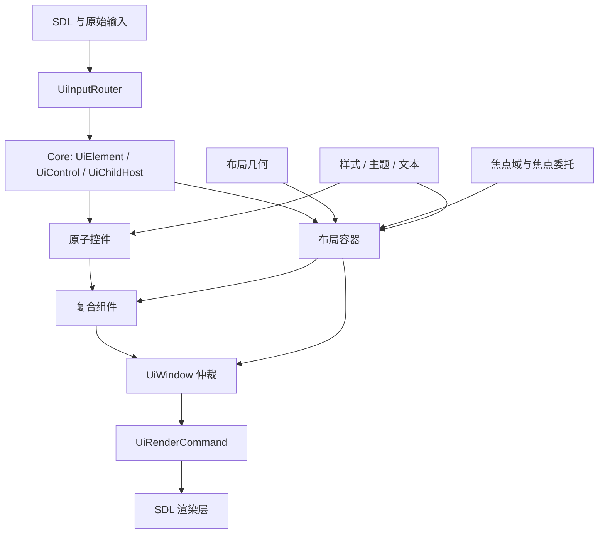
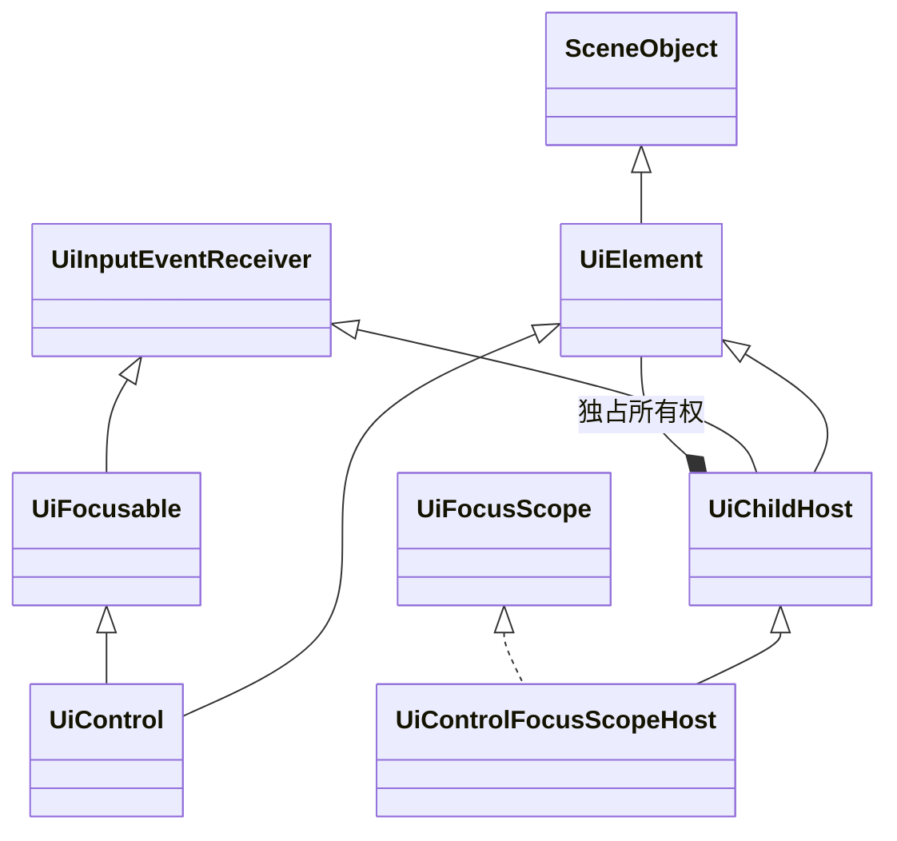
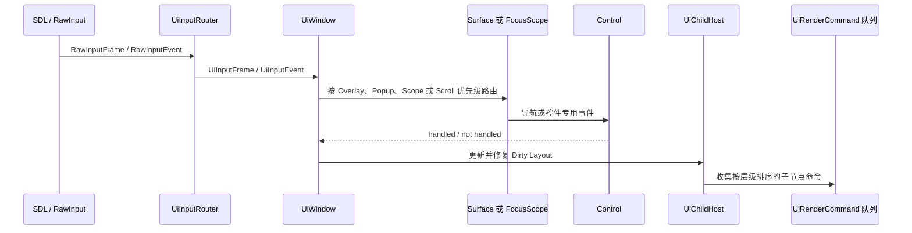
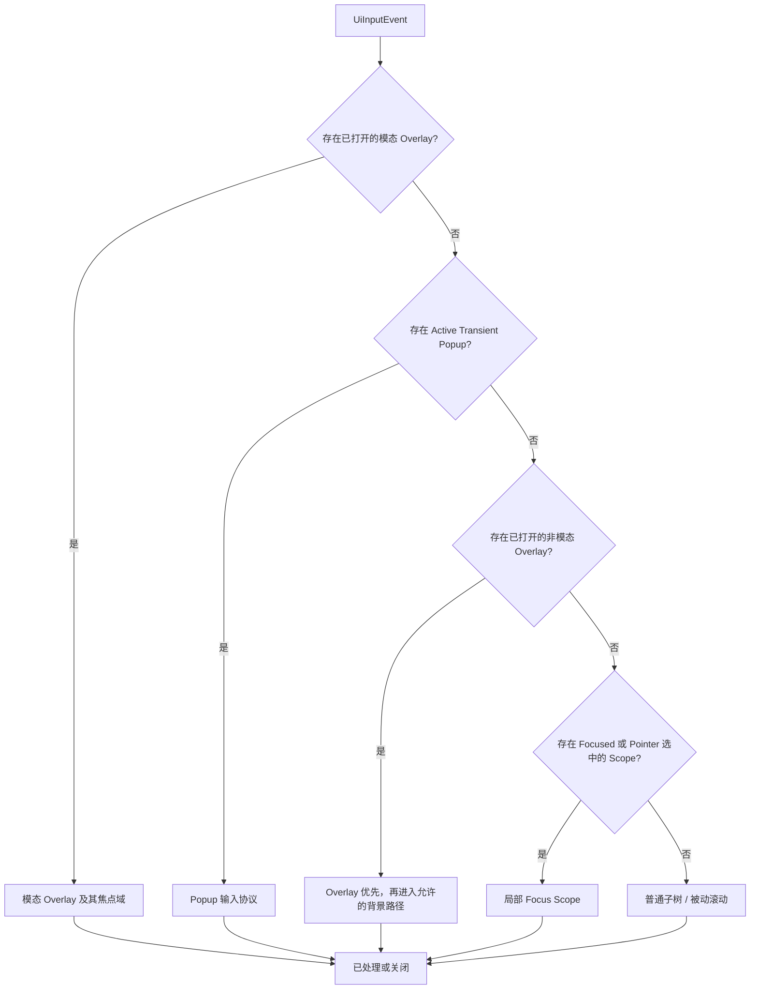
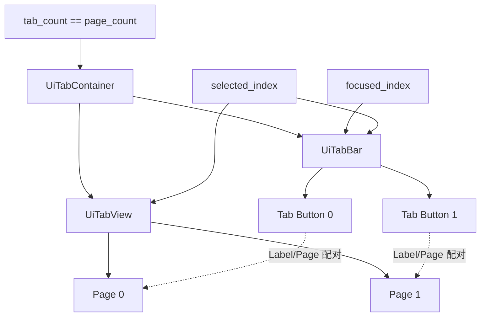

# 面向2D游戏的可组合多输入UI框架设计与实现——以 Elysia Engine 为例

> **文档类型：** 本科课程论文  
> **验证版本：** `dfac1cee3d90e2476140701cd9c432a8e4e0ca36`  
> **验证日期：** 2026年7月20日（太平洋夏令时）  
> **实现背景：** Elysia Engine 的 `engine/ui` 模块，代码由 Moonline 游戏项目承载

## 摘要

游戏用户界面不仅要适配多种输入设备，还要支持嵌套菜单，并在控件显示、隐藏或销毁后维持正确的焦点状态。如果每个控件都自行实现输入路由，这些需求很容易形成重复且互相冲突的规则。本文介绍 Elysia Engine 使用的一套保留式 UI 框架。它是 Moonline 项目内部开发的 C++23 二维游戏引擎子系统，将持久化 UI 元素、交互控件、拥有子节点的容器、局部焦点域和窗口级策略分开处理。`UiWindow` 集中负责焦点域导航、模态 Overlay、临时 Popup、被动 Tooltip 与滚动目标选择。容器以 `std::unique_ptr` 表达子节点所有权，对外返回的裸指针通常只用于借用访问。本文以 `UiTabContainer` 为主要案例，说明组合、焦点委托以及 `tab_count == page_count` 不变量如何共同工作，并分析布局、样式、文本、表现效果与渲染命令生成。在所验证版本中，UI 模块共有133个 C++ 头文件和实现文件，包含23,532行物理代码；测试组包含13个 CTest 套件、56个具名测试函数，以及419处对本地 `require(...)` 辅助函数的源码调用。在 Windows MSVC Debug 环境中连续运行十轮，13个套件每轮均全部通过。这些结果能够支持当前实现中已经测试的行为，但不能证明其跨平台完整性、无障碍能力或大规模性能。

**关键词：** 游戏用户界面；保留式UI；焦点导航；多输入；组合；C++所有权；Elysia Engine

## 1. 绪论

### 1.1 问题背景

游戏 UI 并不只是绘制在场景上方的一组按钮。主菜单可能较简单，但设置界面经常同时包含标签页、可滚动区域、文本框、Popup、Tooltip 和确认对话框。同一个界面还可能由鼠标、键盘或手柄控制，而不同设备的交互预期并不相同：鼠标直接指向屏幕坐标；键盘和手柄通常移动逻辑焦点；文本框需要字符输入与输入法组合事件；模拟摇杆还可能作为重复导航或滚动来源。

SDL 将键盘、鼠标、滚轮、文本、窗口和控制器数据统一放在 `SDL_Event` 联合体中[1]，控制器映射机制也能把不同物理手柄归一化为较稳定的逻辑手柄控制项[2]。这些能力提供了良好的平台基础，但不会替游戏 UI 决定“向左导航”“确认”“取消”“Home”或“Page Down”等动作的含义。当模态对话框、下拉 Popup 或嵌套焦点区域同时存在时，引擎仍需判断哪个对象应优先收到事件。

焦点是另一项主要复杂度。W3C 键盘界面指南把组件之间的移动与复合组件内部的方向移动分开讨论[3]；Tabs Pattern 也允许“移动焦点”和“激活标签页”成为两个不同操作[4]。这些原则源于 Web 无障碍设计，但其中的交互区分同样适用于游戏菜单。玩家可以先浏览不同标签，而不立即切换页面，直到按下 Confirm 才提交选择。另一方面，当页面被隐藏或子节点被移除时，原焦点可能失效。框架必须修复状态，避免多个控件同时显示焦点，或继续向已销毁对象发送输入。

UI 编程模型也会影响架构。Dear ImGui 用较直观的方式比较了即时模式 API 与保留控件树的传统工具包[5]。Elysia Engine 使用跨帧存在的 C++ 对象，因此分层布局、缓存状态、裁剪、焦点域和长期存在的复合控件都较自然；与此同时，框架也必须明确处理所有权、失效传播、清理和状态同步。本文研究当前实现如何解决这些责任，但不主张保留模式在所有场景下都优于即时模式。

### 1.2 研究问题与范围

本文的核心问题是：

> 一个小型二维游戏引擎应如何组织持久化 UI 框架，使布局、所有权、多设备输入、嵌套焦点和分层表面保持可组合并便于测试？

本文通过当前 `elysia::ui` 实现回答该问题，讨论范围包括：

- 持久化 UI 对象模型；
- 子节点所有权与运行时树结构修改；
- Anchor、List、Grid 与 Scroll 布局；
- 样式、主题、文本与表现效果；
- 键盘、鼠标和手柄输入的归一化；
- 局部焦点图与嵌套焦点委托；
- Window 层的 Overlay、Popup、Tooltip 和滚动仲裁；
- 以 `UiTabContainer` 为主案例的复合组件；
- 仓库中已有的自动化与交互式验证。

本文不讨论玩法 HUD 的数据绑定、可视化编辑器、存档、网络或完整渲染后端。Elysia UI 只产生 `UiRenderCommand`，SDL 对命令的实际执行属于引擎渲染层。Moonline 是承载并使用该代码的游戏项目；本文始终将引擎称为 **Elysia Engine**。

### 1.3 主要工程贡献

框架主要体现了四项工程选择。

第一，基础元素状态、交互能力和子树所有权被分开。`UiControl` 与 `UiChildHost` 是分别从 `UiElement` 派生的两个分支，容器无须伪装成一个按钮式原子控件。

第二，子节点所有权是显式的。容器接收 `std::unique_ptr<UiElement>`，只把裸指针用于非拥有访问。这符合 C++ Core Guidelines 的一般建议：智能指针表达所有权转移，裸指针通常表达非拥有关系[6]。当回调修改 UI 树时，稳定的子节点生命周期记录还能保护缓存遍历句柄。

第三，局部机制与全局策略被分离。焦点域负责一个区域内控件到控件的导航；`UiWindow` 负责焦点域之间的移动，并判断模态 Overlay、临时 Popup、Tooltip、焦点滚动区域或普通子树谁拥有优先级。

第四，较大的控件主要通过组合构建。`UiTabContainer` 拥有 Tab Bar 和 Tab View，`UiConfirmationDialog` 拥有 Chrome Container 与动作控件。外层复合对象协调不变量、回调、委托焦点和主题行为，而不是继承一个外观相近但职责不同的具体控件。

这些设计并非新的算法。其价值在于，它们在同一实现中形成了边界一致、具有文档并可自动测试的工程方案。

## 2. 需求与设计目标

### 2.1 功能需求

该框架面向二维引擎中的菜单与游戏界面。主要需求及其实现责任如表1所示。

| 需求 | 框架应对方式 | 主要责任方 |
| --- | --- | --- |
| 持久化视觉元素 | 矩形、层级、透明度、可见性、表现平移与渲染命令提交 | `UiElement` |
| 交互控件 | Enabled、Focused 状态与离散输入接收 | `UiControl` 与 `UiFocusable` |
| 嵌套所有权 | 子节点独占所有权、提取、清理、更新、输入和渲染遍历 | `UiChildHost` |
| 可复用布局 | Anchor、一维 List、二维 Grid、Padding、Alignment 与滚动视口 | 布局辅助函数与容器 |
| 多种输入设备 | 与设备无关的 UI Action，以及指针、文本、滚轮和 Axis 数据 | `UiInputRouter` |
| 方向导航 | 局部控件图、相邻焦点域、嵌套委托与失效修复 | Focus 子系统与 `UiWindow` |
| 分层表面 | 模态 Overlay、临时 Popup、被动 Tooltip、放置、关闭与焦点恢复 | `UiWindow` |
| 一致的表现 | 主题色、字段级样式覆盖、Typography Role、裁剪、透明度与平移效果 | Style、Text、Effects 与渲染命令 |
| 可复用复杂控件 | Tabs、Dropdown、Dialog、Labeled Controls 与 Settings Preset | Composite 层 |

*表1 设计需求及其主要责任方。*

### 2.2 设计目标

首要目标是**责任清晰**。输入转换不应了解标签页的内部构造，Tooltip 不应自行决定全局层级，布局辅助函数也不应拥有场景对象。因此，平台输入、UI Action、局部焦点、Window 路由与渲染被保留为不同阶段。

第二个目标是**可组合性**。系统应允许 List 放入 Scroll Container，再把 Scroll Container 放入 Tab Page，最后把 Tabs 放入 Window。相同的叶子控件不需要了解所有可能的父类型。

第三个目标是**可预测的生命周期**。子节点的拥有者应能从类型和接口上看出；回调移除或重新排序子节点时，树遍历仍应安全；借用注册关系则应尽可能在失效时修剪或显式注销。

第四个目标是**设备无关的意图与设备相关的策略并存**。键盘方向键与手柄方向输入都可变为 `UiAction::NavigateDown`，但事件仍保留 `InputDevice`，因为鼠标焦点与手柄焦点的策略不同。抽象动作并不意味着抹除全部设备信息。

第五个目标是**状态转换可测试**。焦点修复、Popup 清理、Selection 同步、Style Cascade、Clipping 与 Callback 应能在不运行完整玩法场景时被观察。因此，仓库把 UI 行为构建为独立 CTest 目标，同时提供交互式 UI Test Scene。

### 2.3 非目标

当前系统并不是通用桌面 GUI 工具包。它没有无障碍树、屏幕阅读器语义、可视化编辑器、声明式标记、自动数据绑定，也没有覆盖所有平台的完整输入法抽象。Touch 尚未作为 UI 类型中的一等 `InputDevice`。内置主题主要控制颜色，而不是覆盖所有度量值的完整 Design Token 系统。明确这些边界，有助于按照当前游戏引擎用途评价模块，而不是把它与更大的产品类别直接比较。

## 3. 总体架构

### 3.1 分层结构

实现按责任而非具体界面拆分。图1给出了简化依赖关系。



*图1 Elysia Engine UI 框架的主要分层。*

`core` 定义基础树角色；`layout` 保存可复用几何规则；`widgets` 包含 Button、Slider、Text Input、Label、Image 和 Bar 等原子元素；`containers` 拥有并排列子树；`focus` 描述局部导航区域与委托；`composites` 把多个 Widget 或 Container 组织成一个实用组件；`window` 负责全局交互策略；`style`、`text` 与 `effects` 提供跨层的表现数据。

这是一种保留式对象模型，UI 元素跨帧存在，只在状态改变时更新。因此系统能够保存焦点图、选中索引、滚动偏移、文本编辑状态和表现动画；代价是树发生变化时，失效与清理逻辑必须正确。

### 3.2 三个核心角色

`UiElement` 是通用节点。它继承引擎的 `SceneObject`，并增加屏幕空间几何、视觉层级、透明度、表现平移和渲染命令提交。它还保存一个非拥有的布局父指针。`screen_rect` 保存布局分配结果；指针命中测试通常使用 `presentation_screen_rect()`，其中加入了累计的表现平移。因此，入场动画可以同时移动渲染与命中测试结果，而不必每帧改写布局分配。

`UiControl` 增加 `UiFocusable`。`UiFocusable` 是输入接收能力，`UiControl` 将其与元素结合，代表按钮、复选框、滑块和文本框等原子交互对象。

`UiChildHost` 位于另一条分支，它把 `UiElement` 与 Update、Frame Input 和离散 Event Receiver 结合，并拥有一组 `ChildEntry`。每项包含 `std::unique_ptr<UiElement>`、布局选项、样式关系元数据，以及供缓存句柄使用的共享生命周期记录。因此 Host 可以拥有非交互内容、交互控件、其他 Host 或完整焦点域。



*图2 核心类型角色与子节点所有权。*

关键在于，`UiControl` 与 `UiChildHost` 并不是一条直线继承链。拥有子节点的 Panel 不会自动获得原子控件语义。当容器还需要管理局部控件图时，它继承 `UiControlFocusScopeHost`，由后者组合 `UiChildHost` 与 `UiFocusScope`。

### 3.3 单帧数据流

数据流被划分为多个阶段：原始输入先变成 UI Frame Snapshot 与若干 UI Event，Window 应用全局优先级，被选中的 Surface 或 Focus Scope 执行局部规则，之后再更新、修复布局并收集渲染命令。



*图3 从原始输入到渲染命令的简化帧流程。*

框架把 Frame Snapshot 与离散事件看作两种数据形式。Snapshot 适合查询按住状态和模拟量；Event 适合 Press、Release、Pointer Move、Text Input 与 Wheel Step 等状态边缘。这样每个控件不必从 Held State 中重复推导按下和释放。

### 3.4 与场景和渲染器的边界

UI 对象属于场景对象，但 UI 子树由 `UiWindow` 等根元素独立拥有。场景创建根 Window，并可按需要保存某些控件的非拥有指针；真正拥有者仍是 Window 或其他 Host。

渲染同样被分开。UI 节点向队列追加带类型的 `UiRenderCommand`，父 Host 可以对某个子节点产生的整段命令统一应用透明度、表现平移和裁剪，随后由 SDL Render Command Executor 真正绘制。Button 因此不必为了每一层父效果自行保存与恢复 SDL Renderer 状态。

这一边界也让 Scene、UI 与 Renderer 之间保持单向的数据关系。Scene 负责根对象的生命周期与每帧阶段，UI 树负责把自身状态整理成命令，Renderer 只消费命令而不反向拥有 Widget。由此，控件既能复用引擎的 SceneObject 生命周期，又不会把 SDL 绘制细节扩散到每个 Container 和 Composite 中。

## 4. UI树、布局、样式与生命周期

### 4.1 所有权与借用访问

`UiChildHost::add_child` 接收 `std::unique_ptr<UiElement>`，成功插入后，独占所有权转入 `ChildEntry`。`create_child<T>` 把构造与转移合并为一步，再返回 `T*` 供借用访问；`extract_child` 则执行反向操作，把 `unique_ptr` 交还调用方。这让所有权变化在接口上保持可见，也支持具有回滚需要的复合操作。

这一选择与 C++ Core Guidelines 一致：`unique_ptr` 表示单一所有权，以该类型作为函数参数意味着转移[6]。`create_child` 返回的裸指针并不拥有对象，保存它的代码必须服从 Host 与 Child 的生命周期。

框架仍存在借用注册指针。`UiWindow` 记录 Focus Scope、Overlay、Transient Popup、Tooltip 和被动滚动目标，但不会为它们取得额外所有权；多数注册对象已经被 Window 子树拥有，修剪逻辑会检查它们是否仍可使用。这避免了共享所有权环，但不等于形式化的生命周期安全。尤其是 `UiTooltip` 拥有其 Content，却只借用 Trigger。Window 能清除从同一管理树中离开的 Trigger，而任意外部 Trigger 的生命周期仍需要调用方约束。

### 4.2 树结构修改时的安全遍历

UI 回调可能立即改变树。Button 回调可以关闭 Dialog、删除父节点、切换 Tab 或重建 Dropdown。若直接遍历 `unique_ptr` 向量，回调修改容器后就可能出现无效迭代器。

`UiChildHost` 使用 `ChildLifetime` 与 `UiChildHandle` 处理这一问题。生命周期记录保存 Element 指针和 Generation；缓存的逻辑顺序与视觉顺序列表保存该记录的共享指针及预期 Generation。当 Entry 被移除或替换时，记录失效且 Generation 增加，旧句柄便解析为 `nullptr`，而不会得到已经删除的对象。Host 同时区分逻辑与视觉顺序：更新和普通树行为采用逻辑顺序；更高视觉层级优先接收输入，并显示在更上方。

该机制减少了一类实际的 Use-After-Free 问题，但不会让系统中所有借用指针自动安全。复合组件成员指针和场景保存的外部指针仍须在生命周期边界同步清理。

缓存策略还规定了树修改何时可见。某个 Child 在遍历过程中删除自己或兄弟后，旧句柄会立即失效，后续步骤不会再次访问它；同一遍历中新加入的 Child 则等到下一轮缓存重建后再参与。这种规则避免了“新增对象是否应在当前帧重复执行”的不确定性。框架没有在局部捕获用户 Callback 异常，异常会继续传播到应用事件边界，因此这里保证的是结构遍历安全，而不是任意回调的异常隔离。

### 4.3 布局失效与几何

`screen_rect` 是通用布局结果。Child 尺寸变化时会通知布局父节点发生 Intrinsic Layout Invalidation，Dirty 状态向上传播，Host 在输入或渲染前按需重建。这样无需每帧无条件重新排列全部容器。

通用 Child Options 包括 Anchor、Alignment、期望尺寸和 Margin。`UiPanel` 支持锚定放置；`UiListContainer` 按一个方向排列节点，并提供 Spacing 与 Cross-Axis Alignment；`UiGridContainer` 按行列放置，也能建立二维焦点关系；`UiScrollContainer` 只拥有一个内容表面，把 Viewport Clipping、Scroll State、可选 Scrollbar、输入路由与 Focus Scope Proxy 放在一起。

布局几何与表现几何被有意分离。平移效果修改 `presentation_translation`，命中测试使用累积后的表现矩形，而下一次布局仍看到原来的分配矩形。这样动画偏移不会反向改变期望布局，再进一步改变动画目标。

### 4.4 渲染命令组合

每个可见 Child 都向共享向量追加命令。Child 返回后，Parent 把该段命令作为整体处理，可统一应用 Translation、Alpha Multiplication 与 Clip Intersection。这形成了位于 Widget 与 SDL 之间的一层轻量命令组合。

父容器因而能够控制完整子树的效果。Scroll Viewport 不需要每个 Label 和 Image 了解滚动与裁剪；淡出的 Panel 可以统一调整所有后代命令的 Alpha；Renderer 则继续负责把命令转成 SDL 操作并恢复渲染状态。

### 4.5 样式、主题、文本与效果

Style 由 Base Value 与字段级 Optional Override 组成。交互 Widget 可根据 Enabled、Hovered、Pressed、Focused、Selected 与 Adjustment 等状态解析颜色；Visual Role 则允许同一个 Widget 类请求不同的语义样式，例如 Default Button 或 Tab Button。

`UiThemeManager` 注册 Root，并通过 `UiThemeStyleResolver` 重新应用 `UiTheme`。内置 Adapter 按精确动态类型选择。Container 还可以把内部 Child 标记为 Composite Implementation，使其服从外层组件语义，而不是作为互不相关的主题根。当前内置主题主要是颜色 Payload，不能把它描述成完整的 Design Token 或样式表语言。

文本被分为 Content 与 Typography。`UiTextContent` 可保存原始文本或 Localization Key；Typography Role 解析字号等文本渲染输入。`UiLabel`、`UiTextBlock` 和 `UiNumber` 分别处理不同显示需求。`UiTextInput` 维护私有编辑纹理状态，除导航动作外，还接收 Text Input 和 Text Editing 事件。

Effects 层包含小型透明度与平移状态机，由 Image、Label 与 Element 变体使用。这些效果只改变表现，不拥有布局。Overlay API 虽然声明了 `Slide` Transition 枚举，但 `UiWindow` 当前没有执行 Overlay Transition 的状态机。因此本文只把 Overlay Placement 与 Visibility 视为已实现能力，把过渡动画列为未完成内容。

## 5. 输入、焦点、滚动与窗口仲裁

### 5.1 输入归一化

引擎输入系统先把 SDL 数据转换为 `RawInputFrame` 和 `RawInputEvent`。Scene 把原始输入交给 Gameplay Receiver，也把它送入 `UiInputRouter`。Router 为 Held State 产生一个 `UiInputFrame`，并为离散变化产生一组 `UiInputEvent`；它还可以根据手柄左摇杆合成重复滚动。

`UiAction` 表示与设备无关的意图，包括四个方向、Confirm、Cancel、Tab、Backspace、Delete、Home、End、Page Up 与 Page Down。`UiInputEventType` 保留 Payload 类型，包括 Action Press/Release、Mouse Move、Pointer Press/Release、Wheel、Text Input、Text Editing 与 Axis Change。Event 仍记录来源 `InputDevice` 和原始 Control，使多个设备可以共用控件逻辑，同时又不必把鼠标与手柄视为完全相同。

当前 Binding 是 `ui_input_router.cpp` 中的编译期映射。Enter、Numpad Enter 与手柄 South Button 对应 Confirm；Escape 与手柄 East Button 对应 Cancel；方向键与 D-pad 对应导航。这一做法简单而确定，但尚不是允许用户重绑定的 UI Action System。SDL Controller Mapping 先归一化设备布局[2]，随后由引擎进行 UI 专用映射。

Gamepad Scroll Synthesizer 独立处理左摇杆 X/Y。越过 Dead Zone 后，两轴分别累积并产生 Wheel Step，因此对角输入可以同时滚动两个方向。Synthesizer 会限制单次更新的步数，并在交互会话重置时清除累积状态。Mouse Wheel 和生成的 Gamepad Scroll 因而能复用同一套处理路径。

Unity 6.5 的 UI 文档同样把 Navigation Event 视为可能来自 D-pad、Joystick、Escape、Enter 或方向键的意图，而非特定设备，并指出 Navigation Event 并不必然要求焦点移动[7]。Elysia 的实现不同，但这一思想支持“归一化意图”和“消费意图的策略”相互分离。

### 5.2 作为局部导航图的焦点域

`UiFocusScope` 是局部焦点域边界，对外提供定义该区域的 Element、Scope 是否激活、当前 Focused Target，以及某方向是否可导航。系统使用两种邻接关系：

- `UiFocusNeighbors` 连接同一 Scope 内的 Control；
- `UiFocusScopeNeighbors` 在 Window 层连接不同 Scope。

因此框架形成两级图，而不是一个全局列表。Grid 可定义单元格之间的上下左右关系；Window 可以规定 Sidebar 位于 Content Scope 左侧，而无须知道两个区域内部的每个控件。

`UiControlFocusScopeHost` 保存 Focus Entry 向量，每种具体 Container 按自身结构重建 Registry。导航时，Focused Control 先获得消费事件的机会，这对会自行使用方向键的 Slider 或 Text Field 很重要；Control 不消费时，Host 才尝试已注册 Neighbor。到达局部边界后，`UiWindow` 可以移动到相邻 Focus Scope。

这是一张显式图。当前实现不会根据任意屏幕几何自动搜索最近控件。显式 Neighbor 对设计好的菜单更稳定，但新增 Container 必须正确建立自己的 Registry。

### 5.3 焦点修复与输入设备策略

只有当 Control 仍存在、Active、Visible、Enabled 且仍在 Registry 中时，保存的 Focus Target 才有效。`synchronize_focus_state` 会移除已销毁 Child、刷新 Registry、调用 `ensure_valid_focus`，再把结果应用到控件视觉。当前 Target 失效时，Host 可恢复上一次仍可用的 Target，或选择第一个可用项。

最近使用的输入设备会改变修复策略。指针不在目标上时，鼠标输入可以让一个 Scope 暂时没有 Focused Control；Keyboard 与 Gamepad 输入则恢复上一个仍可用的 Target，或选择第一个可用项。由 Pointer 选中的 Control 也可能成为以后恢复时的优先目标。

W3C 指南强调可预测的焦点移动、清晰的焦点视觉，以及 Keyboard Focus 与 Selected State 之间的区别[3]。Elysia 并非 Web 无障碍实现，但这些概念说明一个 Boolean 不足以描述全部状态：引擎还需要 Active Scope、Scope 内的 Focused Control、上次首选 Target，以及触发决策的设备。

### 5.4 嵌套容器中的焦点委托

组合会产生嵌套 Scope。Tab Container 拥有 Tab-Bar Scope 与 Page-View Scope；Selected Page 可能包含 Chrome Container，内部又包含 Scroll Container 和 List。如果外层复合对象复制所有内部焦点逻辑，状态很容易不一致。

`UiDelegatedFocusMixin` 是一个非拥有桥接层。重建 Focus Registry 时，它查找嵌套区域中的 Live Control，把它们加入外层 Host 的图，并记录每个 Control 真正所属的 Scope。焦点进入委托区域时，Mixin 要求该区域选择有效 Target；局部导航结束后，再把嵌套结果同步回外层 Host。因此外层 Scope 可以参与 Window 导航，而内层 Scope 继续负责自己的 Focused Target。

这一设计也有成本：Composite 必须明确区域之间的 Transition，并在正确生命周期点调用同步。其优点是 Scroll、Tab 与 Chrome 仍是独立焦点域，而不是被合并成一个庞大的 Container 类。

### 5.5 滚动路由

`UiScrollContainer` 组合 Clipped Viewport、单个 Content Payload、横纵 Scroll State、可选 Scrollbar 与 Content Focus Proxy。Mouse Wheel 先交给合适的内容；若内容未消费，再由 Scroll Container 修改自身 Offset。

Gamepad Scroll 需要额外策略。`UiWindow` 在收集 Focused Scroll Container 时先访问 Active、Visible 的后代，再访问父容器；第一个可用的 Focused Container 接收生成的 Wheel Event。若没有容器获得焦点，Window 会先复用最近由 Pointer 提升的可用目标，否则按同样的“后代先于父节点”遍历选择首个可用容器。Page Up/Down 按 Viewport 大小移动，Home/End 直接移动到边界。

当 Gamepad Scroll 实际移动内容后，Scope 可以暂时清除 Child Focus Visual，并在后续导航时恢复，避免同一摇杆滚动 Viewport 时仍显示一个静止的聚焦行。当前 Focused Gamepad 路由在找到第一个可用 Container 后就停止，即使它已到边界，因此尚不支持从内部边界向外层容器继续传递滚动。

### 5.6 Window 层表面仲裁

`UiWindow` 是根 UI Container，而不是操作系统窗口包装器。它保存 Window 层注册关系，并决定 Event Priority。图4概括当前路由顺序。



*图4 `UiWindow` 中的简化输入优先级。*

Overlay 是 Window 直接拥有并通过 `UiOverlayOptions` 注册的 Child。Options 描述 Open、Modal、是否可由 Cancel 或 Outside Click 关闭，以及 Placement。打开 Overlay 时可以保存之前的 Focus Scope 并把焦点交给 Overlay；关闭时，仅在原 Scope 仍可用的情况下恢复。

Transient Popup 使用不同协议。实现组件继续拥有 Popup State，只把输入和渲染操作暴露给 Window；同一时刻只有一个 Active Popup，激活新 Popup 会关闭旧项。该模式适合 Dropdown List：它在视觉上可以越过普通 Child Clipping，但逻辑上仍属于 Dropdown Control。

Tooltip 是被动表面，不实现焦点，也不消费输入。Window 会检查 Trigger Reachability、祖先可见性、Clipping、Presentation Translation、Modal State、Popup Occlusion 以及 Pointer/Focus Reachability。Tooltip 命令在普通 Child 和 Active Popup 之后提交。Epic 的 CommonUI 指南也作出相似的实用区分：Tooltip 通常不应夺取输入，而 Popup 与 Modal Menu 可能需要阻挡其他 UI[8]。这只是行业层面的比较，并不表示两者实现相同。

当对象离开 Window 管理树时，Window 还会修剪注册关系。这能减少 Stale Pointer，但注册本质上仍是借用关系，API 需要正确的 Detach 行为，也并非所有外部生命周期都由 Checked Handle 表示。

因此，Window 的价值并不只是“位于最外层”。它把输入优先级、表面层级和焦点恢复放在同一个仲裁点，避免 Dropdown、Dialog 与 Tooltip 各自对背景输入作出互相矛盾的判断。局部组件仍保存自己的内容和状态，Window 只决定何时允许其接收输入或追加额外渲染命令，这正是局部机制与全局策略分离的具体体现。

## 6. 复合组件案例研究

### 6.1 选择 `UiTabContainer` 的原因

`UiTabContainer` 规模适中，却涉及多数框架边界：它拥有内部 Child，参与布局与焦点委托，区分浏览状态和提交状态，触发 Callback，并在增删后修复状态。它还公开了一个清晰不变量：Tab Label 数量必须与 Page 数量相等。

图5展示其内部结构和两个索引状态。



*图5 `UiTabContainer` 的组合结构与同步状态。*

### 6.2 Focus 与 Selection 是不同状态

Tab Bar 分别保存 Selected Button 与 Focused Target。左右导航只改变 Focus；Confirm 激活当前 Button，并提交 Selection。Tab View 只显示 Selected Page，其余 Page 会变为 Inactive 与 Invisible。这与 W3C Tabs Pattern 描述的手动激活方式一致[4]。Elysia 不实现 ARIA Role 或 Browser Tab Order，但采用了同样有用的交互区分。

两个索引能防止导航时意外切页，也让玩家在确认前浏览标签时获得可预测的手柄交互。Scene 如需直接控制，也可以分别设置 Focus 和 Selection。

### 6.3 事务式添加与删除

`add_tab` 接收 Label 与 `unique_ptr` Page。它先把 Page 加入 `UiTabView`，再要求 `UiTabBar` 创建 Label Button。若 Label 创建失败，方法会提取刚加入的 Page，并通过 `UiTabAddResult::rejected_page` 返还。所有权不会丢失，Pair Count 也会在返回前恢复。

第一个成功加入的 Tab 会在 Bar 和 View 中同时成为 Selected；后续添加不改变当前选择。内部修改期间，`_mutating` 抑制中间同步 Callback。成功后，Container 标记 Layout Dirty、刷新 Focus Entry，并检查配对数量。

删除操作先记录旧 Focus 与 Selection，再同时提取 Label 和 Page。若被删项处于活动状态且后方仍有项，则沿用相同数值 Index；否则选择之前的最后一项。被删除位置之后的 Index 全部减一。只有内部状态恢复一致后，外部 Callback 才会运行。

不变量通过 `assert(tab_count() == page_count())` 检查，并由专用 Tab API 维护，但它不是 Release Build 的形式化证明。继承来的公开 Child 操作仍可绕过专用路径，因此调用方还需遵守使用约定。现有测试覆盖 Focus/Selection 分离和嵌套导航，但没有直接制造 Tab Label 创建失败，也未遍历全部动态删除情况。

### 6.4 Tab Bar 与 Page 之间的焦点委托

Composite 建立两个委托区域：Tab Bar 向下连接 Tab View，Tab View 向上连接 Tab Bar。从 Bar 按 Down 时，Selected Page 会尝试聚焦其第一个可用 Control；从 Page Content 的边界按 Up 时，则恢复 Tab Bar 当前 Target。其他导航在真正的嵌套 Scope 中继续进行，直到到达已定义边界。

这说明组合不仅是视觉嵌套。外层组件负责协调区域，内层区域仍保留自己的焦点规则；同一 Mixin 也可以服务于包含其他 Focus Scope 类型的复合控件。

### 6.5 辅助案例

`UiConfirmationDialog` 展示模态组合。它继承 `UiControlFocusScopeHost`，拥有 `UiChromeContainer`，并在内部构建 Title、Message、Close、Cancel 与 Confirm。注册默认值是居中的 Modal Overlay。Action Row 把 Cancel 放在首位，因此初始焦点落在更安全的关闭动作上。Confirm 会先关闭 Overlay，再调用用户 Callback，Callback 因而可以切换 Scene 或销毁旧 UI，而不会留下仍处于 Open 状态的 Dialog。

当前 Config 声明了 Confirm 与 Cancel 的 Visual Role 字段，但同步代码尚未读取它们，本文不把这两项当作已经可用的定制能力。Message 使用会缩放适配的单行 `UiLabel`，而不是富文本或多行内容系统。

`UiTooltip` 展示混合所有权。它以 `unique_ptr` 拥有显示 Content，却借用 Trigger Element。Tooltip 由 `UiWindow` 更新和绘制，因此可以显示在 Popup Content 上方，同时不成为 Modal 或 Focus Scope。Window 发现 Trigger 离开自己的管理子树时会清除引用，但这个裸指针并不是通用生命周期句柄；若调用方绑定外部 Trigger，仍需在正确时机 Clear 或 Unregister。

## 7. 验证与结果

### 7.1 验证环境

本节数据来自 Git 修订 `dfac1cee3d90e2476140701cd9c432a8e4e0ca36`，验证日期为2026年7月20日。使用的构建树是 `out/build/x64-Debug`，Generator 为 Ninja，配置为 Debug，MSVC x64 Compiler 版本为19.51.36248.0，MSVC Toolset 为14.51.36231，CMake/CTest 为4.3.1-msvc1。另一个根目录 `build` 使用 MinGW，不属于本次 MSVC 结果。

该版本的 `engine/ui` 包含78个头文件与55个实现文件，共133个 C++ 文件；物理行数为23,532，其中20,301行为非空行。这些数字只描述模块规模，并不直接代表质量。

`tests/ui` 包含13个 C++ 测试程序，共3,464个物理行。`tests/CMakeLists.txt` 将其注册为13个带 `ui` Label 的 CTest Target。源码检查得到56个具名 `test_*` 函数，以及419次对本地 `require(...)` 断言辅助函数的调用。一个具名函数并不等于一个独立 CTest Target，因此两种数量必须分开报告。

### 7.2 测试映射

| 测试关注点 | 主要 CTest 套件 | 已覆盖行为示例 |
| --- | --- | --- |
| 布局与几何 | `ui_layout_tests`、`ui_presentation_tests` | List Extent、Scroll Measurement、子树平移、变换后的命中测试 |
| 样式与渲染 | `ui_style_tests`、`ui_stroke_rendering_tests` | Style Cascade、Theme Propagation、交互边框、Renderer State 恢复 |
| 焦点生命周期 | `ui_focus_lifecycle_tests`、`ui_focus_tree_tests` | 空 Scope、嵌套传播、首选叶节点恢复、隐藏或删除 Target |
| 输入与滚动 | `ui_focus_routing_tests` | Tab Focus/Selection、键盘/手柄矩阵、双轴合成、被动 Scroll Target |
| 分层表面 | `ui_popup_lifecycle_tests`、`ui_tooltip_visibility_tests` | 注册清理、Modal/Popup 遮挡、Clipping、Tab 切换可见性 |
| 动态树安全 | `ui_callback_safety_tests` | Callback 删除/重排、缓存遍历句柄、异常传播 |
| 控件状态 | `ui_selection_controls_tests`、`ui_text_input_rendering_tests`、`ui_number_rendering_tests` | Group Repair、Callback 保留、编辑纹理、本地化字形复用 |

*表2 与本文主张对应的测试套件。*

### 7.3 重复执行

13个 UI Target 已完成构建且处于最新状态，随后按顺序连续运行十次：

```powershell
ctest --test-dir out\build\x64-Debug -C Debug -L ui --output-on-failure
```

每轮均通过13/13个套件。十轮合计执行130次套件，130次全部通过，失败数为0。CTest 报告的每轮总耗时依次为0.79、0.59、0.63、0.75、0.52、0.53、0.62、0.63、0.78和0.65秒，中位数为0.63秒；外部 Wall-Clock 测量中位数为0.664秒。

这一重复执行只用于检查稳定性，不是 UI 性能基准。测试程序规模较小，其总耗时不能代表大型渲染界面的运行成本。

### 7.4 交互式测试场景

引擎 Testbed 中的 `UiTestScene` 包含 Root `UiWindow`、主 `UiTabContainer`、嵌套 Tabs、Scroll Container、Selection Control、Theme Switch、Confirmation Overlay、Dropdown Popup 与 Tooltip。它为难以仅通过孤立断言理解的行为提供了手工集成界面。


*图6 用于视觉验证的 Elysia Engine UI 交互测试场景。*

在重新构建的 MSVC Debug 二进制中进行人工检查时，方向输入能够在不切换 Overview 选中页的情况下移动 Tab Label 焦点；随后使用 Pointer 激活 Containers 布局页，并打开 Dropdown、确认 Overlay，以及在配置延迟后显示 Tooltip。图6记录了该次运行中的确认 Overlay。截图属于集成效果的视觉证据，而不是 Pixel-Perfect Regression Test。

自动化测试与 Test Scene 在这里承担不同任务：前者适合稳定检查 Focus Repair、Selection、Lifetime 和 Routing 等状态转换，后者便于观察嵌套布局、主题切换和多种表面的组合效果。两者相互补充，但都不能替代真实用户研究、不同硬件上的输入测试或大规模界面的性能测量。

## 8. 局限与未来工作

当前输入映射是硬编码的，UI Device Enum 只包含 Keyboard、Mouse、Gamepad 与 Unknown。未来可在不修改单个 Widget 的前提下增加用户重绑定、Touch、Gesture 和平台无障碍输入层。

Focus Neighbor 由 Container 显式建立，对设计好的菜单较可预测，却不是任意几何的通用空间导航算法。Scroll Routing 也会在第一个可用 Focused Container 处停止，因此内部容器到达边界后不会把运动继续交给外层容器。

Theme System 主要基于颜色，并采用精确动态类型 Adapter；它没有 Selector、可继承的 Metric Token，也不会自动支持所有新 Subclass。文本支持 Localization Key、Raw Text、Label、Block、Number 与 Editing，但不是 Rich Text。Effects 只是 Fade、Blink、Pulse 和 Translation Player，而非通用 Timeline。

部分 API 仍包含未完成或依赖使用纪律的契约：`Slide` Overlay Transition 尚未执行；Confirmation Dialog 的两个 Visual Role 配置未接入 Child 同步；Tab Count 不变量依赖专用 API 和 Debug Assertion；Tooltip Trigger 与 Window Registration 仍包含借用裸指针。

现有测试能为单一 Windows/MSVC 配置下的部分行为提供较好的回归证据，但没有 Code Coverage、Memory Sanitizer、Large-Tree Performance、Pixel Snapshot、真实手柄硬件、Compiler/OS Matrix、Accessibility Test 或 User Study。后续工作应测量不同树规模下的布局与事件成本，增加生命周期压力测试，覆盖真实设备，并定义面向无障碍的语义层。

## 9. 结论

Elysia Engine 围绕一棵持久化 UI 树组织框架，并为不同责任设置明确角色。`UiElement` 提供 UI 几何和渲染状态；`UiControl` 增加原子交互；`UiChildHost` 拥有并遍历子树；Focus Host 与 Delegated Scope 处理局部导航；`UiWindow` 则在全局决定 Focus Region、Overlay、Popup、Tooltip 与 Scroll 的优先级。

这一设计的价值来自清晰的交界面。`unique_ptr` 表达 Child 所有权转移；Layout Invalidation 把内容期望尺寸变化传给 Parent Placement；Render Command 使父节点可以对完整子树应用 Clipping、Opacity 和 Presentation Translation；`UiTabContainer` 则说明组合如何在维持配对结构时保留 Focus 与 Selection 两种语义。

所记录版本的测试结果支持本文描述的行为，但并未使该子系统成为完整的通用 GUI 平台。它仍然表明，当前框架不只是互不相关的 Widget 集合，而是一套结构连贯、能够测试的基础设施，可服务于 Moonline 游戏项目的菜单和界面流程，也可供其他 Elysia Engine 场景复用。

## 参考文献

[1] SDL Project, “SDL_Event,” *SDL2 Wiki*. [Online]. Available: <https://wiki.libsdl.org/SDL2/SDL_Event>. [Accessed: Jul. 20, 2026].

[2] SDL Project, “SDL_GameControllerAddMapping,” *SDL2 Wiki*. [Online]. Available: <https://wiki.libsdl.org/SDL2/SDL_GameControllerAddMapping>. [Accessed: Jul. 20, 2026].

[3] W3C WAI-ARIA Authoring Practices Task Force, “Developing a Keyboard Interface,” *ARIA Authoring Practices Guide*. [Online]. Available: <https://www.w3.org/WAI/ARIA/apg/practices/keyboard-interface/>. [Accessed: Jul. 20, 2026].

[4] W3C WAI-ARIA Authoring Practices Task Force, “Tabs Pattern,” *ARIA Authoring Practices Guide*. [Online]. Available: <https://www.w3.org/WAI/ARIA/apg/patterns/tabs/>. [Accessed: Jul. 20, 2026].

[5] O. Cornut and Dear ImGui contributors, “FAQ (Frequently Asked Questions),” *Dear ImGui Documentation*. [Online]. Available: <https://github.com/ocornut/imgui/blob/master/docs/FAQ.md>. [Accessed: Jul. 20, 2026].

[6] B. Stroustrup and H. Sutter, eds., “C++ Core Guidelines,” Jun. 14, 2026. [Online]. Available: <https://isocpp.github.io/CppCoreGuidelines/CppCoreGuidelines>. [Accessed: Jul. 20, 2026].

[7] Unity Technologies, “Navigation events,” *Unity 6.5 Manual*. [Online]. Available: <https://docs.unity3d.com/Manual/UIE-Navigation-Events.html>. [Accessed: Jul. 20, 2026].

[8] Epic Games, Inc., “Design Guidelines for Using CommonUI in Unreal Engine,” *Unreal Engine 5.8 Documentation*. [Online]. Available: <https://dev.epicgames.com/documentation/en-us/unreal-engine/design-guidelines-for-using-commonui-in-unreal-engine>. [Accessed: Jul. 20, 2026].
