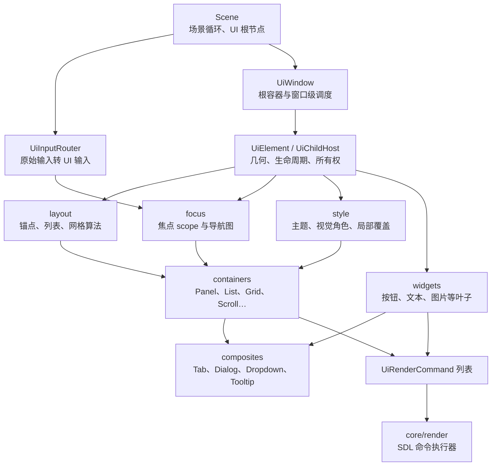
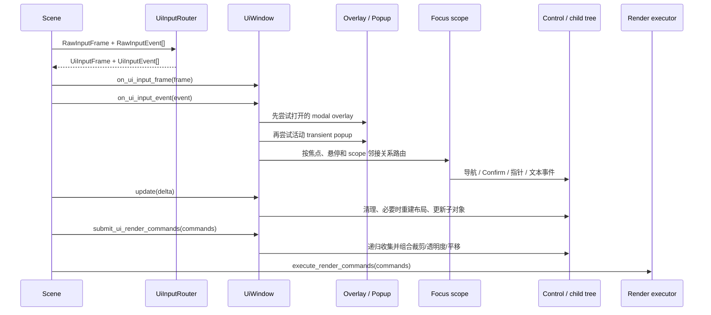
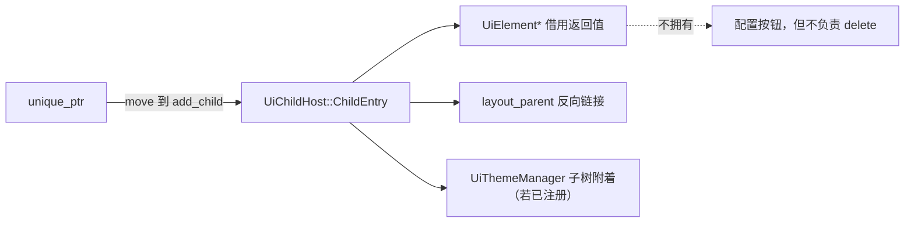
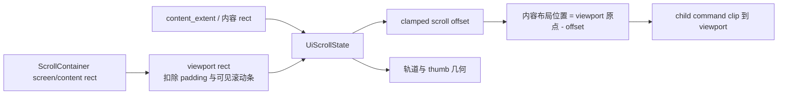
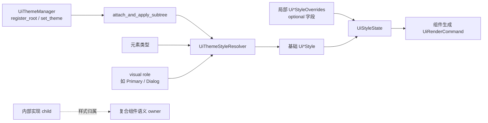

# MoonLine Engine/UI 学习型架构详解

> 面向具备基础 C++ 语法、但尚未读过本项目 UI 代码的读者。本文解释的是当前实现的运行方式，而不是一套抽象的 UI 框架设计提案。若只需要查询某个类的公开接口，请使用 [UI API 参考入口](README.md)；本文的目标是回答“这套系统为什么这样分层、一次交互到底经过了哪里、容器究竟替我做了什么”。

## 1. 先建立整体模型

MoonLine 的 UI 属于 **保留模式（retained-mode）UI**：代码创建 `UiElement` 对象并长期保留为一棵树；每帧更新树的状态，布局在需要时重建，最后由树收集渲染命令。控件本身不直接调用 SDL 绘制 API。



这张图里最重要的边界有三个：

1. `engine/ui` 负责 **状态、布局、输入和命令生成**；它不负责真正画到 SDL renderer。
2. `UiChildHost` 是容器能力的共同地基，具体容器主要是在它的基础上替换“如何布局”和“如何形成焦点图”。
3. `UiWindow` 不是 OS 窗口包装器，而是一个 UI 根容器：它承担跨 scope 焦点、overlay、popup、tooltip 和滚动路由等窗口级语义。

`Scene` 是 UI 与游戏循环的接缝。它保存 UI 根节点，按 UI `order` 处理根节点，并在 [scene.cpp](../../scene/scene.cpp) 中把 `UiRenderCommand` 批量交给渲染基础设施执行。

## 2. 一帧中发生了什么

### 2.1 输入、更新和渲染并不是同一件事

`Scene::on_input` 先将 `RawInputFrame` 交给 `UiInputRouter::route_frame`，再将离散的原始事件转换为 `UiInputEvent`；必要时还会合成连续动作事件。随后场景按 UI 输入顺序分发 frame 和 event。`UiInputFrame` 适合查询“当前是否按住”，`UiInputEvent` 适合处理一次按下、滚轮、指针移动和文本输入等离散行为。



严格说，布局并不只发生在 `update`：`UiChildHost` 在输入和提交渲染命令之前也会调用 `update_layout_if_dirty()`。这样可以避免“刚改完内容就点击/渲染，但还没有等到下一次 update”的陈旧几何问题。它是一种按需、延迟的布局策略。

`Scene::on_update` 还会在普通更新后单独递归调用 `update_presentation_animations(delta)`。这解释了为什么平移动画不应改布局 rect：动画是展示层变化，而布局与命中测试仍有可预测的基础几何。

## 3. 所有容器共享的地基

### 3.1 `UiElement`：树中的基本节点

[`UiElement`](../../ui/core/ui_element.h) 是所有 UI 节点的共同父类，持有以下核心状态：

| 概念 | 当前实现中的含义 | 初学者常见误解 |
| --- | --- | --- |
| `screen_rect` | 当前已经分配的屏幕空间矩形；布局、绘制基础坐标和常规命中测试的事实来源 | 把它当成“想要的尺寸” |
| `content_extent()` | 向父布局报告的内容/内在尺寸；默认返回 `size()`，文本等元素可以覆盖 | 用子元素当前尺寸替代内在测量 |
| `order` | 数值更高的元素在同级中更靠上绘制，也优先接收输入 | 把插入顺序当成唯一 z-order |
| `visible` / `active` | 前者影响绘制，后者影响更新和输入参与 | 只隐藏页面却仍让它响应输入 |
| `opacity` | 元素自身的透明度；host 会再把父级透明度合成到子命令 | 认为父透明度会自动改变子对象状态 |
| presentation translation | 仅用于视觉展示的平移，可由命名平移动画驱动 | 用动画直接改 `screen_rect`，从而破坏布局 |

`presentation_screen_rect()` 和 `presentation_to_layout_point()` 是展示平移与指针空间之间的桥梁。需要按展示后位置命中时，应使用它们；不能把 presentation translation 当成新的布局结果。

### 3.2 `UiChildHost`：所有权、生命周期和命令合成器

[`UiChildHost`](../../ui/core/ui_child_host.h) 同时继承 `UiElement`、`Updatable`、`UiInputFrameReceiver` 和 `UiInputEventReceiver`。这使一个 host 既是树节点，也是子树的更新、输入和渲染调度者。

**所有权规则**：`add_child(std::unique_ptr<UiElement>)` 与 `create_child<T>()` 把所有权移交给 host；返回的 `UiElement*` / `T*` 只是借用指针，方便后续配置，不能在 host 清除、提取或销毁后继续保存和使用。`extract_child` 是少数会把所有权安全交还调用方的操作；`clear_children` 则销毁整棵直接子树。



接管子对象时，host 会建立 `layout_parent` 反向链接、使布局失效，并在已有主题管理器时附着/应用主题子树。移除和 reset 时会反向解除这些关系。因而“容器负责拥有树，窗口/主题/布局只保存借用注册关系”是阅读代码时必须保持的心智模型。

**布局失效链**：子元素尺寸或内在内容改变时，`UiElement::notify_layout_parent_of_intrinsic_layout_invalidation()` 通知父 host；父 host 标记 dirty，并继续向自己的父级冒泡。`UiChildHost` 用 `_is_rebuilding_layout` 和 `_layout_dirty_after_rebuild` 避免重建过程中再次失效导致递归混乱。父容器应通过 padding、child options 或容器 API 调整布局，不应靠手工改子元素 rect 与父布局“对抗”。

**渲染合成**：host 过滤 destroyed/invisible 子项，按 `order` 做稳定排序，让每个子项追加命令。对子项新增的那一段命令，host 再依次应用子项 presentation translation、父级 opacity 和可选的 `content_rect()` 裁剪。这样一个父容器可以统一实现裁剪与透明度，不要求每个叶子控件重复处理。

### 3.3 通用布局数据

[`UiLayoutChildOptions`](../../ui/layout/ui_layout_types.h) 是“这个子节点如何由父节点摆放”的数据。常用字段包括：

- `_anchor`：九宫格锚点；用于 `UiPanel` 和基础锚点布局。
- `_margin`：围绕子项的额外偏移/留白。
- `_size_override` + `_use_size_override`：明确指定 child slot 尺寸。只有设置布尔开关才生效，默认应消费 `content_extent()`。
- `_cross_align` / `_use_custom_cross_align` / `_fill_cross_axis`：供列表等沿主轴堆叠的容器决定交叉轴位置和拉伸。
- host 的 `UiLayoutPadding`：先由 `screen_rect` 扣出 `content_rect()`，再给布局算法使用。

## 4. 焦点不是“一个 bool”，而是一张可导航的图

`UiControl` 添加了 enabled/focused 等交互语义；`UiFocusScope` 定义一个可独立接管导航边界的协议；`UiControlFocusScopeHost` 则把它们结合起来。它维护 `FocusEntry { control, neighbors }`，并在显式生命周期边界同步：清理失效 child、更新布局、重建 focus registry、修复失效焦点、将焦点视觉状态推给控件。

方向键或手柄导航的基本规则是：先让当前控件处理事件；若未消费，则在当前 scope 的 `UiFocusNeighbors` 中找邻居；到边界时 `UiWindow` 才根据 `UiFocusScopeNeighbors` 尝试切到另一个 scope。指针设备还可使用 hover focus 策略，窗口会记录最近驱动焦点决策的输入设备，以区分鼠标与键盘/手柄体验。

嵌套容器不能简单把所有后代控制项压成一个列表。`UiDelegatedFocusMixin` 让 Panel、List、Chrome、Tab 等组合容器把焦点交给内部的子 scope；父容器保留“进入/退出哪个区域”的职责。这正是嵌套滚动页、Tab 页面和 Chrome body 可以各自导航而不会丢失层级的原因。

## 5. 容器逐个阅读

下表先给出选择方向，后续小节解释内部实现。

| 容器 | 主要问题 | 关键特点 | 最适合的内容 |
| --- | --- | --- | --- |
| `UiPanel` | 自由但有规则地放置子项 | 锚点布局 + 增量插入方向 + 焦点链接 | 详情区域、局部面板 |
| `UiListContainer` | 一维连续内容 | 主轴堆叠、间距、交叉轴对齐 | 菜单、设置项、长列表 |
| `UiGridContainer` | 二维规则内容 | 列数、间距、行/列优先填充 | 图标墙、角色卡片 |
| `UiScrollContainer` | 有溢出的一个内容面 | viewport、裁剪、offset、滚动条与嵌套焦点 | 可滚动页面/列表 |
| `UiChromeContainer` | 固定标题栏 + 可替换正文 | 内部 slot host、header/body 焦点交接 | 带工具栏的卡片或页面区段 |
| `UiTabView` / `UiTabContainer` | 多页面互斥显示 | 选中页显隐与焦点委托 | 分页工作台 |
| `UiButtonGroup` / `UiRadioGroup` | 一组选项保持一致 | 互斥选择、样式/回调同步 | 模式切换、单选项 |

### 5.1 `UiPanel`：锚点布局与有方向的插入

`UiPanel` 适合“不是纯列表或纯网格”的局部布局。直接以 `UiLayoutChildOptions` 添加时，它调用锚点布局；调用 `add_child(child, UiPanelInsertDirection)` 时，会相对最近的可聚焦插入点向 Up/Down/Left/Right 推进，并记录 `FocusLink`。后续 `rebuild_focus_registry()` 将这些方向关系转成控制项的邻接图。

所以 Panel 的插入方向不只是视觉位置提示，也会影响焦点导航。嵌套的 child scope 则通过委托保留自身导航图。Panel 还持有 `UiPanelStyle` 与 `UiPanelVisualRole`，适用于需要背景、边框或 Dialog 等语义视觉角色的表面。

**避免的用法**：把 Panel 当可无限扩展的纵向列表，或在添加后手动不断修改 child rect。前者应选择 List；后者会让下一次 dirty layout 覆盖手工位置。

### 5.2 `UiListContainer`：一维流式布局

List 将 `UiListDirection::Vertical` / `Horizontal` 转换为布局层的主轴。`rebuild_layout()` 读取每个 child 的 size override 或 `content_extent()`，按 child 顺序加上 `item_spacing` 依次排放，再按 `cross_align` 处理交叉轴的 Start/Center/End；必要时可以填满交叉轴。`content_extent()` 因而会把所有项目尺寸、间距和 padding 汇总，供外层 List 或 Scroll 测量。

焦点同样遵守一维语义：主轴方向的导航优先在相邻项目/委托 scope 之间流动；不是主轴的方向可以留给上层 scope。`add_front` 和 `add_back` 分别改变列表顺序，因此也会影响布局、绘制和焦点邻接。

### 5.3 `UiGridContainer`：二维单元与二维导航

Grid 用 `column_count`、`cell_spacing` 和 `fill_by_row` 配置规则。布局层基于当前 child 数推导行/列位置，并为每个 child 分配 cell；`fill_by_row=true` 是通常的从左到右再换行，设为 false 则按列填充。`content_extent()` 与 cell 尺寸、行列数、间距和 padding 对应。

与 List 的顺序邻居不同，Grid 的 focus registry 使用行/列坐标构建上、下、左、右邻居。因此它适合真正二维的选择界面；若只是两列设置表单但希望 Tab 顺序式导航，List + Panel 往往更直观。

### 5.4 `UiScrollContainer`：一个内容面、两个空间、三套输入路径

ScrollContainer 是最值得细读的容器。它继承 `UiChildHost`，同时实现 `UiFocusScope`，但其公共语义是 **只管理一个 content**：`set_content`、`content`、`clear_content`。内部维护 `UiScrollState`，该状态由 viewport size、content size、offset、step 和 axis 决定。



- `UiScrollAxis::Auto` 根据内容是否在 x/y 超出 viewport 解析为 Horizontal、Vertical 或 Both；`max_scroll_offset` 是内容大小减 viewport 大小后再限制到非负值。
- `rebuild_layout()` 测量 content、同步 state、计算是否出现 scrollbar、重新计算实际 viewport，并将 content 放到 `viewport.position - scroll_offset`。它强制 `clip_children=true`，防止溢出内容画到视口外。
- 滚动条可 Hidden、Visible 或 Auto。它由内部 `UiDragHandle` 作为 thumb，但滚动条语义仍由 ScrollContainer 控制：thumb 的位置映射到 `UiScrollState` 的 ratio，再换算为 offset。
- 事件路径按优先级处理：正在拖拽的滚动条先处理；指针滚轮可先交给命中的内容；未消费时容器尝试应用滚轮；普通指针/动作事件按命中区域委托给 content。`PageUp`、`PageDown`、`Home`、`End` 等被动滚动输入由窗口协同派发。
- 容器把 content scope 作为自己的焦点目标。手柄滚动实际移动时可临时清掉内容焦点、在合适时恢复，避免焦点提示与正在滚动的视觉行为冲突；有焦点的子控件在相应输入后会通过 `ensure_visible` 自动滚入 viewport。

嵌套 ScrollContainer 的关键不是“所有父层一起滚”，而是窗口从逻辑焦点路径向内优先派发，深层可滚动容器优先消费。为此不要绕开 `UiWindow` 手工给每层发送 page-scroll 事件。

### 5.5 `UiChromeContainer`：组合内部容器，而不是继承一个具体控件

ChromeContainer 展示了本项目偏好的复合方式：它在 `reset()` 中创建四个内部 host——左 action list、title slot、右 action list、body slot。外部 API 不暴露这些内部实现，而是提供 `add_left_action`、`add_title_child`、`add_right_action`、`set_body` 等意图明确的方法。

`rebuild_layout()` 根据 header 是否可见、header 高度、header/body padding，先分出 header/body rect，再布置四个 slot。header 的 action 列表使用一个特殊内部 list：它保留列表布局能力，但不会把自身作为独立 focus scope，避免内部结构泄漏进对外导航。

焦点上，header 的直接控件由 Chrome 管理；body 如果本身是 `UiFocusScope`，则进入 delegated body scope。指针命中 header/body 会决定当前事件路由区域；键盘/手柄则可以在 header 与 body 之间进入/离开。样式上，内部 child 标记为 composite implementation，主题刷新会归属到 Chrome 的语义样式而不是把它们误当独立组件根。

### 5.6 Tab 和选择组：状态同步型容器

`UiTabView` 只显示 `_selected_index` 对应的页面：其他页面同时 `visible=false`、`active=false`，因此不会绘制、更新或接收输入。选择变化会重建布局与焦点 registry；焦点会委托给选中页面的 scope。`UiTabContainer` 则在上层组合 `UiTabBar` 与 `UiTabView`，负责 tab 标签、当前焦点 tab 与选中 page 的联动。

`UiButtonGroup` 建立在 `UiListContainer` 上，只接收 `UiButton`。它在按钮 click 回调前插入组内选择逻辑，维护一个选中按钮，并用 `Primary` / `Default` visual role 刷新样式；若开启 `auto_select_first`，失去当前选择时会补选第一个有效按钮。

`UiRadioGroup` 同样是 List，但面向实现 `UiRadioItem` 的成员。同步时它优先保留当前聚焦且已选中的项，否则保留第一个已选项，若都没有则选择第一个 radio，并清除其余项。选择变化可由 `set_on_selection_changed` 得到一次回调；渲染路径中的延迟同步会用 pending 标志避免无意丢失通知。

## 6. `UiWindow`：窗口级的输入与表面仲裁者

`UiWindow` 仍是一个 `UiChildHost`，所以普通页面是它拥有的 children；但它额外保存多个 **借用注册**：focus scopes、overlays、transient popups 与 tooltips。注册不转移所有权，调用方必须在对象/窗口生命周期结束时解除注册，或依赖窗口的清理逻辑断开反向关系。

### 6.1 Scope 与普通内容

窗口通过 `register_focus_scope` 注册可进入的 scope，并可用 `set_scope_neighbors` 建立跨区上下左右关系。焦点先停留在一个 `UiFocusScope`，scope 再选择其 `focused_target`。窗口会在 child 被移除、禁用、overlay 开关等状态变化后 prune 无效引用并修复焦点；`focus_first_available_scope()` 是初次进入界面的常用入口。

### 6.2 Overlay、popup、tooltip 的区别

| 表面 | 所有权 | 输入与遮挡 | 绘制层级/典型用途 |
| --- | --- | --- | --- |
| Overlay | 仍是 Window 的 owned child，Window 只记录行为 | 可 modal；可取消/外点关闭；关闭时尝试恢复先前 scope | 普通内容之上；Dialog、抽屉、sheet |
| Transient popup | 实现方保留所有权，Window 协调活动项 | 非模态，活动 popup 先收事件 | 普通内容之上；Dropdown 菜单 |
| Tooltip | Window 管理显示注册，内容由 tooltip 协议处理 | 被动显示，不应抢普通输入；popup 可阻挡背景提示 | 最后绘制；悬停说明 |

打开 modal overlay 前，Window 记录可恢复的 focus scope；关闭时如果 scope 仍可用便恢复，否则选择其他可用 scope。`UiOverlayOptions` 还定义 Center/Drawer/Sheet 放置、Slide 展示、fallback size、order 与关闭策略。这里的 `open` 属于窗口注册项的状态，不等同于 child 的对象生命周期。

## 7. 主题与视觉角色如何穿过容器树

主题不是每个控件各自读取全局颜色。`UiThemeManager` 注册 root 后，会附着并应用整棵子树；`UiThemeStyleResolver` 根据元素类型和 visual role 取基础样式；`UiStyleState` 再把仅设置了字段的 overrides 叠到基础样式上。



`UiChildHost` 对新接管的 child 自动附着已存在的主题管理器；`on_child_base_style_invalidated` 则识别 composite implementation child，转而刷新其语义 owner。这样 Chrome、Dialog、Tab 等组合组件的内部节点能够跟随整体语义主题，而不会被错误地当成用户放置的独立主题根。

局部 overrides 用于“同一主题下刻意只改某些字段”；直接把完整基础 style 复制到业务层会削弱换主题的能力。visual role 用于“它在设计上是什么”（例如 Primary、Danger、Dialog），两者不要混用。

## 8. 跟随真实代码阅读：容器测试场景

[`gameplay/scene/ui_test_scene.cpp`](../../../gameplay/scene/ui_test_scene.cpp) 是本教程最好的综合入口。它建立如下真实结构：

```text
UiWindow
├── status UiLabel
├── UiTabContainer
│   ├── UiTabBar（内部）
│   └── UiTabView（内部）
│       └── 每个 page: UiScrollContainer
│           └── UiListContainer
│               └── UiChromeContainer
│                   ├── header actions / title（内部 slots）
│                   └── body: UiListContainer / UiPanel / 各种控件
├── overlay UiPanel / UiDialog / UiConfirmationDialog
└── UiTooltip
```

建议按以下顺序阅读：先看 `page_scroll()`，理解 Scroll 包住 List 的典型搭配；再看 `add_section()`，理解 Chrome 的 header/body 组合；然后看 `rebuild_ui()` 的 Containers、Overlays 和 Theme 区段，分别观察 Grid、嵌套 Tab、隐藏滚动条、overlay 注册、tooltip 注册及主题 root 注册。这里所有 `get()` 保存的指针都是在 `std::move` 转交所有权前取得的借用指针，生命周期受最终 host 控制。

测试与实现互相印证：

- [`ui_callback_safety_tests.cpp`](../../../tests/ui/ui_callback_safety_tests.cpp)、[`ui_style_tests.cpp`](../../../tests/ui/ui_style_tests.cpp)、[`ui_popup_lifecycle_tests.cpp`](../../../tests/ui/ui_popup_lifecycle_tests.cpp) 与 [`ui_presentation_tests.cpp`](../../../tests/ui/ui_presentation_tests.cpp)：所有权、移除、主题附着、overlay/tooltip 生命周期与渲染范围。
- [`ui_focus_tree_tests.cpp`](../../../tests/ui/ui_focus_tree_tests.cpp)：List、Grid、Panel、Scroll、Chrome 的嵌套焦点行为。
- [`ui_focus_routing_tests.cpp`](../../../tests/ui/ui_focus_routing_tests.cpp)：窗口级 scope 路由、嵌套滚动与指针/手柄策略。

## 9. 扩展或排错时的检查清单

新增容器前，先决定它是简单 `UiChildHost`，还是还需要成为 `UiFocusScope` / `UiControlFocusScopeHost`。然后逐项检查：

1. **所有权**：是否只通过 `unique_ptr` 接管 child；移除/reset 时是否清理所有借用注册和缓存裸指针？
2. **布局**：哪些设置会 `mark_layout_dirty()`；`content_extent()` 是否反映子内容；重建时是否只写 child 的已分配 rect？
3. **输入**：frame 广播与离散 event 的顺序是否一致；命中、拖拽和已消费事件是否会错误地继续向下传？
4. **焦点**：是否重建 registry；child 被禁用、隐藏、销毁时能否修复焦点；嵌套 scope 是合并还是委托？
5. **渲染**：是否尊重 visible/order；父级 opacity、presentation translation 与 clip 是否只应用一次且范围正确？
6. **主题**：是否拥有明确 visual role 与 style state；内部实现 child 是否应标记为 composite implementation？
7. **测试**：至少覆盖 child 移除、尺寸改变后的重布局、键盘/手柄导航、指针命中、嵌套容器，以及主题或表面注册的生命周期。

高频故障通常来自四类误解：保存了已被 host 销毁的借用指针；直接改 child rect 却忘记父布局会重建；注册 overlay/popup/tooltip 后没有处理生命周期；把嵌套 focus scope 当成普通 child 而跳过委托。遇到问题时，先检查这些边界，再检查具体控件逻辑，效率通常更高。

## 10. 推荐阅读路线

1. 先读本文第 1～3 节，建立树、所有权、布局 dirty 和渲染命令的共同语言。
2. 读第 4 节和 [输入、焦点与滚动专题](concepts/input_focus_scroll.md)，再结合 focus tests 验证理解。
3. 依次阅读 List、Grid、Scroll、Chrome 的头文件与实现；不要一开始从 Dialog 或 Dropdown 反推底层机制。
4. 打开容器测试场景，把每一种容器组合与运行时行为对应起来。
5. 最后阅读 [当前 UI 架构与实现思路](architecture.md)、[使用指南](usage-guide.md) 和各 API reference，把概念落回具体调用。

掌握以上链路后，阅读任意 widget 或 composite 时都可以用同一套问题拆解：它的几何谁分配？谁拥有它？输入由谁先路由？焦点属于哪个 scope？它生成哪些渲染命令？主题在何处应用？这正是该 UI 系统最稳定的理解框架。
