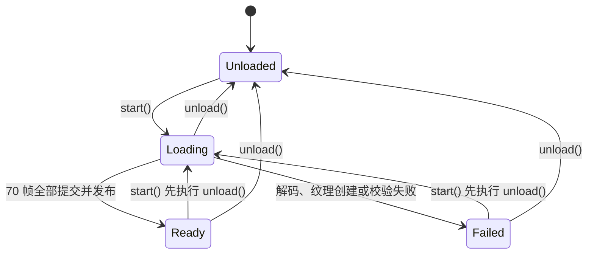
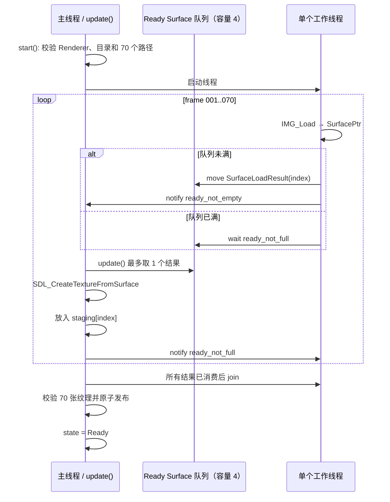

# Elysia 动画异步加载设计

本文描述 [`ElysiaAnimationLoader`](elysia_animation_loader.h) 后续实现异步帧加载时应采用的内部结构。目标是把 PNG 文件读取和解码移出渲染线程，同时限制解码结果的驻留数量，再由主线程逐帧创建 GPU 纹理。

本文只讨论 Loader 内部。`ElysiaScene` 接入、UI 播放控件、动画 FPS、循环策略和视觉布局不在本文范围内。文中的接口和伪代码是后续实现建议，本次没有对应代码落地。

## 1. 资源现状与目标

当前 `assets/engine/textures/elysia/` 中包含 140 张 PNG：

```text
Elysia_001.png
Elysia_002.png
...
Elysia_140.png
```

每张图片均为 1280×720。当前 140 张文件的磁盘压缩体积约为 125.94 MiB；正式方案以 `Elysia_001.png` 至 `Elysia_070.png` 为目标，前 70 张压缩体积约为 63.04 MiB。实施前应删除或移出 71–140 帧，Loader 本身仍应严格生成 70 个预期路径，而不是扫描目录并接受额外文件。

以每像素 4 字节的 RGBA 表示估算：

```text
单帧解码大小 = 1280 × 720 × 4
               = 3,686,400 bytes
               = 3.515625 MiB

70 帧  = 246.09375 MiB
140 帧 = 492.18750 MiB
```

这两个数字既可近似表示全部 `SDL_Surface` 的 CPU 内存，也可作为未压缩 GPU 纹理大小的估算。驱动的像素格式转换、对齐和内部副本可能让实际显存更高。

如果先解码全部 70 帧，再统一创建纹理，加载末期可能同时持有约 246 MiB Surface 和约 246 MiB Texture，峰值接近 492 MiB。140 帧采用相同方式时，仅这两份数据就可能接近 984 MiB。这是之前资源占用接近 1 GiB 的主要原因。

首版不创建 coverage mask。否则每帧还会多出一张同尺寸 mask 纹理，最终显存会再次明显增加。

## 2. 为什么需要拆成两个线程阶段

当前资源代码已经提供了两层职责明确的 API：

- [`SurfaceLoader`](../resources/texture/surface_loader.h) 使用 `IMG_Load` 将文件解码为拥有所有权的 `SurfacePtr`。
- [`TextureLoader`](../resources/texture/texture_loader.h) 使用 `SDL_CreateTextureFromSurface` 将 Surface 转换为 `TexturePtr`。

异步加载应沿用这个边界：

| 阶段 | 执行线程 | 工作 | 结果所有权 |
| --- | --- | --- | --- |
| 路径准备 | 主线程 | 生成并验证 70 个确定路径 | Loader |
| 文件读取与 PNG 解码 | 单个工作线程 | `SurfaceLoader::load_surface()` | `SurfacePtr` |
| 结果交接 | 线程安全队列 | 搬移 `SurfaceLoadResult` | Ready Surface 队列 |
| GPU 提交 | 主线程 `update()` | `TextureLoader::load_texture()` | staging `TexturePtr` |
| 发布 | 主线程 | 全部成功后一次性进入 Ready | Loader 已发布帧集合 |

Renderer 是非拥有指针，只能由主线程阶段使用。工作线程不能调用 `SDL_CreateTextureFromSurface`、`SDL_DestroyTexture` 或其他依赖 Renderer 的操作。

## 3. 状态机

公共状态继续使用当前四个值：



`Loading` 对外保持一个状态即可，内部可以通过计数器区分准备、解码、提交和发布阶段，没必要把这些细节扩展为公共枚举。

后续建议将 `start()` 扩展为显式依赖形式：

```cpp
bool start(
    SDL_Renderer* renderer,
    std::filesystem::path frame_directory);
```

调用新的 `start()` 时先执行一次完整 `unload()`，使 Ready、Failed 和半途 Loading 都能安全重启。参数校验失败时立即进入 `Failed` 并设置错误信息，不创建工作线程。

## 4. 有界解码流水线

### 4.1 固定一个工作线程

首版只使用一个工作线程，理由如下：

- 70 帧按文件名顺序解码，自然保持结果顺序。
- 不需要处理多个 `IMG_Load` 的并发行为。
- 每个并发解码任务都可能额外占用约 3.52 MiB Surface 内存。
- GPU 提交每帧只有一张，多个解码线程很容易让 Ready 队列长期处于满载。

如果性能测量证明单线程解码是瓶颈，可以后续增加工作线程；届时结果必须继续携带 frame index，并在提交或发布时恢复严格顺序。

### 4.2 Ready 队列上限为 4

工作线程将完成的 `SurfaceLoadResult` 搬入 Ready 队列。队列容量固定为 4：

```cpp
static constexpr std::size_t kReadySurfaceCapacity = 4;
static constexpr std::size_t kTextureCommitBudgetPerUpdate = 1;
```

当队列已满时，工作线程通过条件变量等待。主线程从队列取出结果后通知工作线程继续。这种背压保证 Loader 不会因为 GPU 提交较慢而继续积累几十张 Surface。

队列内最多约有 4 × 3.52 = 14.06 MiB 解码数据。考虑工作线程可能正持有一张尚未入队的 Surface，解码侧峰值约为 17.58 MiB，而不是 70 张全部驻留的 246.09 MiB。

### 4.3 每次 update 提交一张纹理

主线程每次 `update()` 最多从 Ready 队列消费一张 Surface，并调用 `TextureLoader::load_texture()`。这样可以把纹理创建成本摊到多个渲染帧，避免一次性提交 70 张纹理。

一帧一个纹理意味着单看 GPU 提交阶段，60 FPS 下至少需要约 1.17 秒完成 70 帧。实际总时长还取决于磁盘和 PNG 解码速度。首版应优先保证帧时间稳定，之后再通过测量决定是否把预算提高到 2，或改为基于毫秒的时间预算。

## 5. 工作线程与主线程时序



工作线程不应直接修改 `_state`、`_error_message` 或纹理集合。它只产生带成功状态、frame index、路径和 Surface 的结果。主线程在 `update()` 中处理结果并统一决定 Ready 或 Failed，从而减少跨线程共享状态。

## 6. 建议的数据结构

下面是实现所需成员的示意，不是当前代码：

```cpp
struct PreparedFrame
{
    std::size_t index = 0;
    std::filesystem::path path;
    elysia::resources::SurfacePtr surface;
    std::string error_message;
};

struct LoadedFrame
{
    std::filesystem::path path;
    elysia::resources::TexturePtr texture;
};

SDL_Renderer* _renderer = nullptr; // non-owning, main thread only
std::filesystem::path _frame_directory;

std::thread _worker;
std::atomic<bool> _stop_requested = false;
std::mutex _ready_mutex;
std::condition_variable _ready_not_empty;
std::condition_variable _ready_not_full;
std::deque<PreparedFrame> _ready_surfaces;

std::vector<LoadedFrame> _staging_frames;
std::vector<LoadedFrame> _frames;
std::size_t _next_frame_to_decode = 0;
std::size_t _committed_frame_count = 0;
```

`_staging_frames` 在 start 时预先 resize 为 70，结果按 index 写入。只有 70 个槽位全部有效、工作线程结束且 Ready 队列为空时，才把 staging 集合发布到 `_frames` 并进入 Ready。

Loader 应直接持有 `TexturePtr`，而不是把这些场景专用纹理存入全局 `TextureManager`。当前 `TextureManager` 只有整库 `clear()`，没有按 key 删除；写入全局池后无法在不影响其他资源的情况下卸载 Elysia 动画。

### Atlas 限制

当前 [`Atlas::add_frame()`](../resources/atlas/atlas.h) 同时要求有效的基础纹理和 coverage mask，并会查询两者尺寸。由于本方案明确不创建 mask，首版 Loader 不应直接使用现有 Atlas 提交流程。

首版可以只发布本地 `LoadedFrame` 集合。若后续播放层必须使用 `Atlas`，应另行修改 Atlas，使 coverage mask 可为空，同时保持基础纹理尺寸校验；这属于播放/资源 API 的独立改动，不应隐藏在 Loader 实现中。

## 7. 核心伪代码

### 7.1 start

```text
start(renderer, directory):
    unload()
    clear error

    if renderer is null:
        fail on main thread
        return false

    build exact paths Elysia_001.png ... Elysia_070.png
    validate every expected file exists and is a regular file
    if validation fails:
        fail on main thread
        return false

    save non-owning renderer
    resize staging to 70 empty slots
    stop_requested = false
    state = Loading
    launch one worker
    return true
```

不要通过目录遍历决定帧数。严格路径生成可以发现缺帧、命名错误和资源整理未完成的问题，也不会意外把 71–140 帧继续加载进来。

### 7.2 worker loop

```text
for index in 0..69:
    if stop requested:
        exit

    result = SurfaceLoader.load_surface(path[index], index)
    if decode failed:
        push failed result when queue has room
        notify main thread
        exit

    wait until ready queue has room or stop requested
    if stop requested:
        destroy local Surface and exit

    move result into ready queue
    notify main thread
```

### 7.3 update

```text
if state is not Loading:
    return

move at most one result out of ready queue
notify worker that queue has room

if result reports failure:
    fail on main thread
    return

texture = TextureLoader.load_texture(renderer, result)
if texture creation failed:
    fail on main thread
    return

store TexturePtr in staging[result.index]
increment committed count

if worker finished and committed count == 70 and queues are empty:
    join worker
    validate every staging slot
    swap staging into published frames
    state = Ready
```

`SurfacePtr` 应在本次 update 结束前释放，确保已提交帧不会继续保留 CPU 解码副本。

### 7.4 failure

```text
fail(message):
    request worker stop
    wake every condition variable
    join worker
    clear ready surfaces
    clear staging textures on main thread
    keep published frames empty
    clear renderer pointer
    save error message
    state = Failed
```

失败必须是事务性的：不能发布前 30 张成功纹理并让调用方看到一个不完整动画。

### 7.5 unload

```text
unload():
    request worker stop
    wake ready_not_empty and ready_not_full
    join worker if joinable

    clear non-owning frame descriptions first
    clear ready Surface queue
    clear staging TexturePtr collection
    clear published TexturePtr collection
    clear path, counters, renderer and error
    state = Unloaded
```

不能 detach 工作线程。detach 后 Loader 可能已经析构，而线程仍在访问队列、停止标记或错误缓冲区，形成 use-after-free。

`IMG_Load` 本身不提供对单次文件解码的强制取消。`unload()` 可以要求停止后续帧，但仍需等待当前一张 PNG 解码结束再 join。单帧约 1 MiB 压缩数据，这个有限等待比脱离线程生命周期更安全。

## 8. 所有权与析构顺序

推荐所有权关系如下：

```text
ElysiaAnimationLoader
├── worker thread                    owning
├── Ready Surface queue              owning SurfacePtr
├── staging frames                   owning TexturePtr
├── published frames                 owning TexturePtr
├── optional frame descriptions      non-owning SDL_Texture*
└── SDL_Renderer*                    non-owning
```

清理顺序必须遵守：

1. 停止并 join 工作线程，确保不会再产生 Surface。
2. 清空所有保存裸纹理指针的帧描述。
3. 清空 Ready Surface 和 staging 纹理。
4. 清空已发布纹理，在主线程触发 `SDL_DestroyTexture`。
5. 最后丢弃 Renderer 指针并恢复状态。

Loader 的析构函数最终应调用 `unload()`。这也意味着 Loader 必须在 Renderer 销毁之前析构，并且析构发生在允许销毁 SDL 纹理的主线程。调用方仍应显式 unload；析构清理只是最后一道安全保障。

## 9. 并发不变量

实现和测试必须保持以下不变量：

- `_ready_surfaces.size()` 永远不超过 4。
- 只有工作线程写入 Ready 队列，只有主线程消费。
- 只有主线程修改 Loader 公共状态、错误信息和纹理集合。
- 工作线程不访问 Renderer，不创建或销毁 Texture。
- 每个 frame index 最多提交一次，Ready 时恰好存在 70 张纹理。
- `Ready` 状态下没有工作线程、Ready Surface 或 staging 纹理残留。
- `Failed` 状态下不发布任何帧。
- `Unloaded` 状态不持有线程、Surface、Texture 或 Renderer 指针。
- `unload()` 可以在 Unloaded、Loading、Ready 和 Failed 任一状态重复调用。

## 10. 错误信息

错误消息应包含阶段、帧编号和路径，便于定位缺帧或损坏文件。例如：

```text
Elysia animation validation failed: frame 37 is missing: .../Elysia_037.png
Elysia animation decode failed: frame 12: .../Elysia_012.png
Elysia animation texture creation failed: frame 48: SDL error text
```

工作线程只把错误文本放进 `PreparedFrame`。主线程消费失败结果后再更新 `_error_message` 和 `Failed` 状态，避免为公共查询接口增加额外锁。

## 11. 测试策略

后续实现时应把文件解码和纹理提交封装成可替换依赖，以便不依赖真实 GPU 测试状态机。至少覆盖：

- 70 个路径严格生成，缺少任一帧立即失败。
- Ready 队列在慢主线程下不会超过 4。
- 解码结果按 index 提交，最终顺序为 1–70。
- `update()` 每次最多创建一张纹理。
- 中途解码失败不会发布部分结果。
- 中途纹理创建失败会释放 staging 纹理。
- Loading 状态 unload 会唤醒阻塞工作线程并完成 join。
- start、失败、重试、重复 unload 的状态转换。
- Ready unload 后所有 Surface、Texture 和线程计数归零。
- Loader 析构不会留下 joinable thread。

集成测试再使用少量临时 PNG 和软件 Renderer 验证 `SurfaceLoader → TextureLoader` 路径，不需要在每个单元测试中加载完整 70 帧。

## 12. 建议实施顺序

1. 扩展 `ElysiaAnimationLoader` 的 start 参数、线程成员和可替换加载依赖。
2. 实现严格的 70 帧路径生成与输入校验。
3. 实现单工作线程、容量 4 的 Ready 队列和停止协议。
4. 实现主线程每次一张纹理的 update 提交。
5. 实现 staging、原子发布、失败回滚和重复 unload。
6. 补齐状态机、背压、失败和析构测试。
7. 测量实际解码时间、纹理提交耗时、CPU 峰值和显存，再决定是否调整工作线程数或提交预算。

在完成测量前，不应直接增加线程数或一次提交多张纹理。这个方案首先解决的是主线程卡顿、瞬时双份内存和无法单独卸载，而不是追求最高加载吞吐量。
